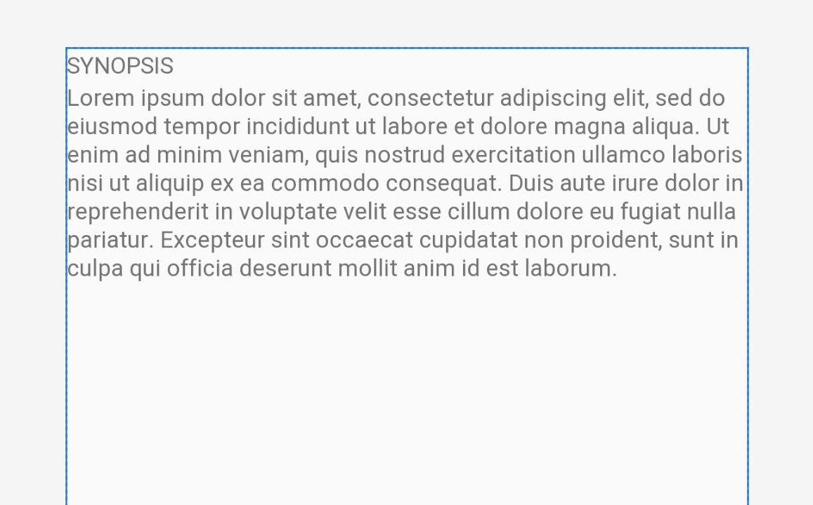
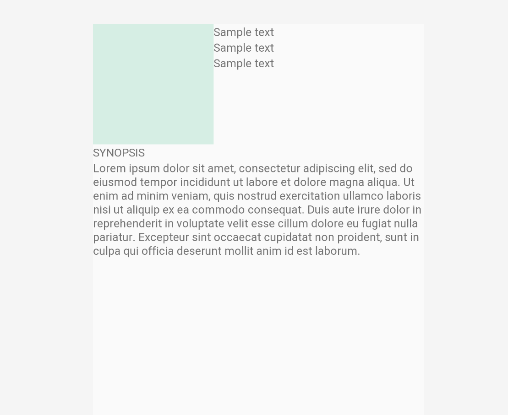

# Detail Activity layout 만들기 

### 간단하게 Detail Layout 을 만들어 봅시다.

1. 우선, 가장 상위 레이아웃은 `LinearLayout` 으로 지정합니다. 
2. `LinearLayout` 안에 `RelativeLayout` 두 쌍을 만듭시다. 모두 closing tag 가 명시적으로 보이도록 `<RelativeLayout></RelativeLayout>` 과 같이 만들어 줍시다. 
3. **우선 아래쪽 Relative Layout 부터 만들어 봅시다. 이곳엔 영화의 줄거리가 들어갈 것입니다.** 

📌진행하기 전에 string resource 에다가 아래의 sample string을 추가해 주세요. 

    <string name="sample_text">Sample text</string>
    <string name="sample_long_text">Lorem ipsum dolor sit amet, consectetur adipiscing elit,
     sed do eiusmod tempor incididunt ut labore et dolore magna aliqua. Ut enim ad minim veniam, quis nostrud exercitation ullamco laboris nisi ut aliquip ex ea commodo consequat. Duis aute 
    irure dolor in reprehenderit in voluptate velit esse cillum dolore eu fugiat nulla pariatur.
    Excepteur sint occaecat cupidatat non proident, sunt in culpa qui officia deserunt mollit anim id est laborum.</string>

- **sample text 를 이용해서 Text View 두개를 넣어봅시다.**

    <?xml version="1.0" encoding="utf-8"?>
    <LinearLayout xmlns:android="http://schemas.android.com/apk/res/android"
        android:orientation="vertical"
        android:layout_width="match_parent"
        android:layout_height="match_parent">
    
        <RelativeLayout
            android:layout_width="match_parent"
            android:layout_height="wrap_content"
            >
    
    
        </RelativeLayout>
    
        <RelativeLayout
            android:layout_width="match_parent"
            android:layout_height="wrap_content"
            >
    
            <TextView
                android:id="@+id/tv_detail_synopsis_title"
                android:text="SYNOPSIS"
                android:layout_width="wrap_content"
                android:layout_height="wrap_content"/>
    
            <TextView
                android:layout_below="@id/tv_detail_synopsis_title"
                android:text="@string/sample_long_text"
                android:id="@+id/tv_detail_synopsis"
                android:layout_width="wrap_content"
                android:layout_height="wrap_content"/>
    
        </RelativeLayout>
    
    
    </LinearLayout>

- 아래와 같이 배치가 된 것을 볼 수 있습니다.

- 제목 "Synopsis" 부분은 항상 ***줄거리 내용 보다 위에 배치가 되어야*** 합니다. 따라서 아래의 줄거리 내용 TextView 에 **layout_below 속성을** 적용해 주었습니다.

---

4. 이제 위에 영화의 포스터, 제목, 평점, 개봉 날짜를 적어줄 칸을 만들어 줍시다. 

5. 첫번째 Relatvie Layout 안에 아래와 같이 Image View + TextView 세개를 담을 Linear Layout 을 만들어 줍시다. 

    <?xml version="1.0" encoding="utf-8"?>
    <LinearLayout xmlns:android="http://schemas.android.com/apk/res/android"
        android:orientation="vertical"
        android:layout_width="match_parent"
        android:layout_height="match_parent">
    
        <RelativeLayout
            android:layout_width="match_parent"
            android:layout_height="wrap_content"
            >
            
            <ImageView
                android:id="@+id/img_detail_movie_poster"
                android:background="@color/colorLightSky"
                android:layout_width="150dp"
                android:layout_height="150dp"/>
            
            <LinearLayout
                android:id="@+id/detail_texts"
                android:layout_toEndOf="@id/img_detail_movie_poster"
                android:orientation="vertical"
                android:layout_width="wrap_content"
                android:layout_height="wrap_content">
            
                <TextView
                    android:id="@+id/tv_detail_movie_title"
                    android:text="@string/sample_text"
                    android:layout_width="wrap_content"
                    android:layout_height="wrap_content"/>
        
                <TextView
                    android:id="@+id/tv_detail_movie_vote_avg"
                    android:text="@string/sample_text"
                    android:layout_width="wrap_content"
                    android:layout_height="wrap_content"/>
        
                <TextView
                    android:id="@+id/tv_detail_movie_date"
                    android:text="@string/sample_text"
                    android:layout_width="wrap_content"
                    android:layout_height="wrap_content"/>
                
            </LinearLayout>
    
    
        </RelativeLayout>
    
        <RelativeLayout
            android:layout_width="match_parent"
            android:layout_height="wrap_content"
            >
    
            <TextView
                android:id="@+id/tv_detail_synopsis_title"
                android:text="SYNOPSIS"
                android:layout_width="wrap_content"
                android:layout_height="wrap_content"/>
    
            <TextView
                android:layout_below="@id/tv_detail_synopsis_title"
                android:text="@string/sample_long_text"
                android:id="@+id/tv_detail_synopsis"
                android:layout_width="wrap_content"
                android:layout_height="wrap_content"/>
    
        </RelativeLayout>
    
    
    </LinearLayout>

- 경계를 구분하기 위해 ImageView 에 일단은 background 로 색을 집어넣어 줬습니다.
- **결과는 아래와 같습니다.**

---

- 수업시간에 **Margin 과 Padding 에 대해서 같이 실습 해 봅시다.**
- 앱 만들 때 사용할 기본 무채색은 아래와 같이 추가해 놓고 사용해 주세요
- 꼭 저와 이름을 똑같이 할 필요는 없습니다. (다만 그럴 경우 제 layout 파일을 가져다 썼을 때 color 에 써져있는 이름을 다른 분의 안드로이스 스투디오는 인식을 못할 뿐입니다.)

    <!-- Basic colors -->
        <color name="colorWhite">#ffffff</color>
        <color name="colorTransparentWhite">#54FFFFFF</color>
        <color name="colorTransparent">#00FFFFFF</color>
        <color name="colorHalfTransparent">#20000000</color>
        <color name="colorTransparentBlack">#6F000000</color>
        <color name="matrixGrey">#747574</color>
        <color name="colorDarkGrey">#2B2B2A</color>
        <color name="colorBlack">#000000</color>