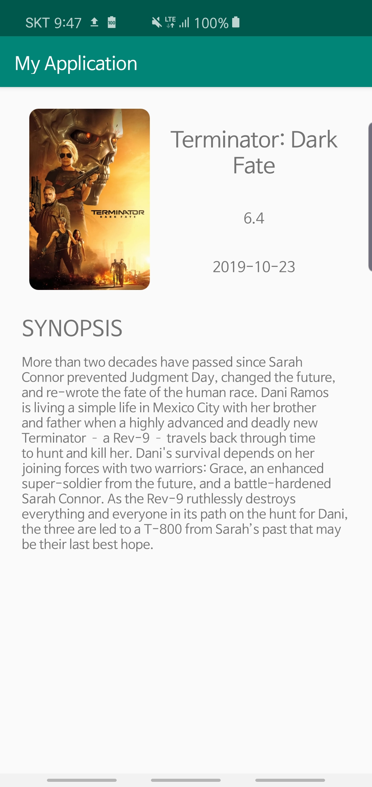

# Remote Data & Database setup 2

## Detail Activity 로 정보 넘기기

- 현재 정보는 MyRecyclerViewAdapter 의 onBindViewHolder 에서 띄워지고 있습니다.

- **Click 할 TextView 초기화 해주기**
- ViewHolder 클래스의 생성자에 클릭을 위한 TextView 찾아주기

    //TODO 35 : Detail 화면으로 넘어갈 때 클릭할 TextView 를 찾아줍니다.
          tvClick = itemView.findViewById(R.id.tv_main_click_me);

- `**onBindViewHolder` 수정하기**

    @Override
        public void onBindViewHolder(@NonNull MyViewHolder holder, int position) {
            //여기서 뷰홀더에 position 별로 데이터 뿌려줌
            //생성자로 넘겨받은 movie 데이터를 연결해 줍시다.
    
            final Movie movie = movies.get(position);
            holder.tvMovieTitle.setText(movie.getTitle());
            holder.tvMovieReleaseDate.setText(movie.getReleaseDate());
            holder.tvMovieVoteAverage.setText(movie.getVoteAverage());
            holder.tvMovieSynopsis.setText(movie.getOverview());
    
            //Glide 사용해서 이미지 띄우기
            //https://image.tmdb.org/t/p/w500/kqjL17yufvn9OVLyXYpvtyrFfak.jpg
    
            //TODO 34 : Glide 디펜던시를 추가하고, 영화 포스터 base url 을 constants 클래스에 추가한 뒤
            //아래와 같이 이미지를 띄우는 코드를 작성합니다.
            Glide.with(context)
                    .load(POSTER_BASE_URL + movie.getPosterPath())
                    .placeholder(R.color.colorHalfTransparent)
                    .error(R.color.colorAccent)
                    .transform(new RoundedCorners(30))
                    .into(holder.imgMoviePoster);
    
            //TODO 36 : 클릭 텍스트를 클릭하면 DetailActivity 로 정보를 넘겨줍니다.
            holder.tvClick.setOnClickListener(new View.OnClickListener() {
                @Override
                public void onClick(View view) {
    
                    //TODO 37 : Intent 객체를 만들어 줍니다. Main 에서 Detail 로 간다는 것을 명시합니다.
                    Intent intent = new Intent(context, DetailActivity.class);
    
                    // TODO 38 : putExtra 메소드 안에 Key 스트링과 movie 객체를 넣어줍니다.
                    //Key 는 Detail 화면에서 정보를 회수할 때 쓰입니다.
                    intent.putExtra("MOVIE_INFO_KEY", movie);
    
                    //TODO 39 : startActivity 를 호출해 줍니다.
                    context.startActivity(intent);
                }
            });
        }

### DetailActivity 코드 수정하기

    package com.gahee.myapplication;
    
    import androidx.appcompat.app.AppCompatActivity;
    
    import android.os.Bundle;
    import android.widget.ImageView;
    import android.widget.TextView;
    
    import com.bumptech.glide.Glide;
    import com.bumptech.glide.load.resource.bitmap.RoundedCorners;
    import com.gahee.myapplication.model.Movie;
    
    import static com.gahee.myapplication.utils.Constants.POSTER_BASE_URL;
    
    public class DetailActivity extends AppCompatActivity {
    
        //TODO 40 : Detail layout 에 있는 뷰들을 선언, 초기화 해 줍니다.
    
        ImageView imgDetailMoviePoster;
        TextView tvDetailMovieTitle;
        TextView tvDetailMovieReleaseDate;
        TextView tvDetailMovieVoteAverage;
        TextView tvDetailMovieSynopsis;
    
    
        @Override
        protected void onCreate(Bundle savedInstanceState) {
            super.onCreate(savedInstanceState);
            setContentView(R.layout.activity_detail);
    
            imgDetailMoviePoster = findViewById(R.id.img_detail_movie_poster);
            tvDetailMovieTitle = findViewById(R.id.tv_detail_movie_title);
            tvDetailMovieReleaseDate = findViewById(R.id.tv_detail_movie_date);
            tvDetailMovieVoteAverage = findViewById(R.id.tv_detail_movie_vote_avg);
            tvDetailMovieSynopsis = findViewById(R.id.tv_detail_synopsis);
    
            //TODO 41 : 넘겨받은 Movie 객체를 회수합니다.
            Movie movie = getIntent().getParcelableExtra("MOVIE_INFO_KEY");
    
            //TODO 42 : 넘겨받은 Movie 객체를 이용해서 View 에 정보를 띄웁니다.
            //Adapter 클래스에서 했던 것과 거의 동일합니다.
    
            Glide.with(this)
                    .load(POSTER_BASE_URL + movie.getPosterPath())
                    .placeholder(R.color.colorHalfTransparent)
                    .error(R.color.colorAccent)
                    .transform(new RoundedCorners(30))
                    .into(imgDetailMoviePoster);
    
            tvDetailMovieTitle.setText(movie.getTitle());
            tvDetailMovieReleaseDate.setText(movie.getReleaseDate());
            tvDetailMovieVoteAverage.setText(movie.getVoteAverage());
            tvDetailMovieSynopsis.setText(movie.getOverview());
    
        }
    }

### activity_detail.xml 레이아웃 파일 최종

    <LinearLayout
        xmlns:android="http://schemas.android.com/apk/res/android"
        android:layout_width="match_parent"
        android:layout_height="match_parent"
        android:orientation="vertical"
        >
    
    <!-- TODO 1 : detail layout 을 디자인 해 주세요 -->
    <RelativeLayout
        android:layout_margin="@dimen/text_margin_24"
        android:layout_width="match_parent"
        android:layout_height="@dimen/intro_box_height"
        >
    
    <!-- TODO 43 : ImageView 의 background 속성을 지워주세요 -->
        <ImageView
            android:id="@+id/img_detail_movie_poster"
            android:layout_width="150dp"
            android:layout_height="match_parent"/>
    
        <LinearLayout
            android:id="@+id/detail_texts"
            android:layout_toEndOf="@id/img_detail_movie_poster"
            android:gravity="center"
            android:orientation="vertical"
            android:layout_width="match_parent"
            android:layout_height="match_parent">
    
            <TextView
                android:id="@+id/tv_detail_movie_title"
                android:text="@string/sample_text"
                android:textSize="@dimen/text_size_medium"
                android:layout_weight="1"
                android:gravity="center"
                android:layout_width="wrap_content"
                android:layout_height="wrap_content"/>
    
            <TextView
                android:id="@+id/tv_detail_movie_vote_avg"
                android:text="@string/sample_text"
                android:textSize="@dimen/text_size_small"
                android:layout_weight="1"
                android:gravity="center"
                android:layout_width="wrap_content"
                android:layout_height="wrap_content"/>
    
            <TextView
                android:id="@+id/tv_detail_movie_date"
                android:text="@string/sample_text"
                android:textSize="@dimen/text_size_small"
                android:layout_weight="1"
                android:gravity="center"
                android:layout_width="wrap_content"
                android:layout_height="wrap_content"/>
    
        </LinearLayout>
    
    
    </RelativeLayout>
    
        <RelativeLayout
            android:layout_marginEnd="@dimen/text_margin_24"
            android:layout_marginStart="@dimen/text_margin_24"
            android:layout_marginBottom="@dimen/text_margin_24"
            android:layout_width="match_parent"
            android:layout_height="wrap_content"
            >
    
        <TextView
            android:id="@+id/tv_detail_synopsis_title"
            android:text="@string/synopsis"
            android:textSize="@dimen/text_size_medium"
            android:layout_marginBottom="12dp"
            android:layout_width="wrap_content"
            android:layout_height="wrap_content"/>
    
        <TextView
            android:layout_below="@id/tv_detail_synopsis_title"
            android:text="@string/sample_text_long"
            android:id="@+id/tv_detail_synopsis"
            android:layout_width="wrap_content"
            android:layout_height="wrap_content"/>
    
        </RelativeLayout>
    
    </LinearLayout>

### 결과

