# Remote Data Fetching & Database Setup

- **아마 이 설명만 보시면 많이 헷갈리실 수 있는데, 제 My Application 이라는 깃헙 레포에 올려둔 파일을 git pull 해서 받아보시면 (혹은 zip 파일 다운로드) IDE 맨 하단의 TODO 탭을 클릭하면 저렇게 순서대로 단계를 써놓은 걸 보실 수 있으실 겁니다. TODO 단계와 설명을 비교해 보면서 따라가셔도 좋습니다.**

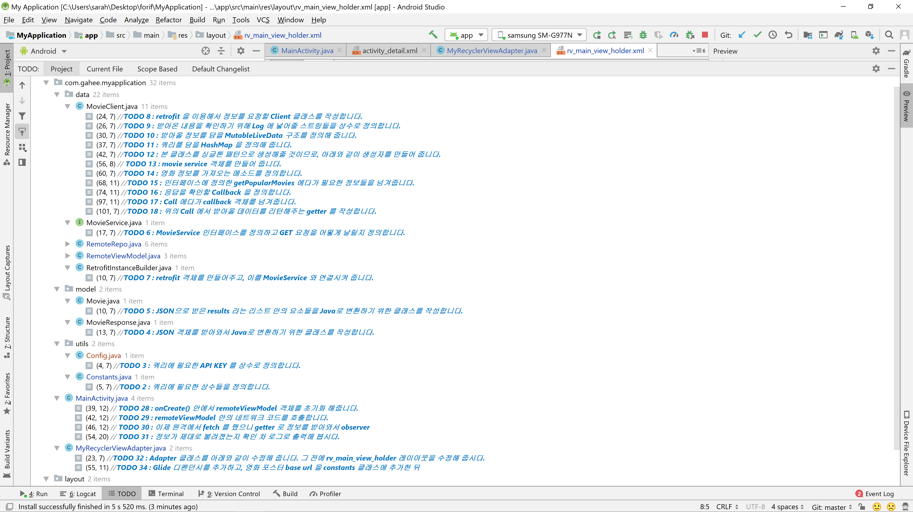

    *** 지난 시간 RecyclerView 를 만들었던 파일에서 실습을 진행해 주세요.***

### 1. Detail Layout 디자인 하기

- 우선 저와 res 폴더 아래의 xml 파일들의 자원 정보가 일치하도록 만들어 주세요.

### dimens.xml

    <?xml version="1.0" encoding="utf-8"?>
    <resources>
        <dimen name="main_view_holder_h">300dp</dimen>
        <dimen name="main_view_holder_text_size_medium">38sp</dimen>
        
        <dimen name="text_size_small">16sp</dimen>
        <dimen name="text_size_medium">24sp</dimen>
        <dimen name="text_size_large">32sp</dimen>
        
        <dimen name="text_margin_24">24dp</dimen>
        <dimen name="intro_box_height">200dp</dimen>
    
    </resources>

### strings.xml

    <resources>
        <string name="app_name">My Application</string>
        <string name="sample_text">sample text</string>
        <string name="sample_text_long">Lorem ipsum dolor sit amet, consectetur adipiscing 
    elit, sed do eiusmod tempor incididunt ut labore et dolore magna aliqua. Ut enim ad 
    minim veniam, quis nostrud exercitation ullamco laboris nisi ut aliquip ex ea commodo 
    consequat. Duis aute irure dolor in reprehenderit in voluptate velit esse cillum dolore 
    eu fugiat nulla pariatur. Excepteur sint occaecat cupidatat non proident, sunt in culpa 
    qui officia deserunt mollit anim id est laborum.</string>
        <string name="synopsis">SYNOPSIS</string>
        </resources>

### colors.xml

    <?xml version="1.0" encoding="utf-8"?>
    <resources>
        <color name="colorPrimary">#008577</color>
        <color name="colorPrimaryDark">#00574B</color>
        <color name="colorAccent">#D81B60</color>
    
    
    <!--    My colors ctrl + / -->
        <color name="colorDeepOcean">#2870B9</color>
    
        <color name="colorWhite">#ffffff</color>
        <color name="colorTransparentWhite">#54FFFFFF</color>
        <color name="colorTransparent">#00FFFFFF</color>
        <color name="colorHalfTransparent">#20000000</color>
        <color name="colorTransparentBlack">#6F000000</color>
        <color name="matrixGrey">#747574</color>
        <color name="colorDarkGrey">#2B2B2A</color>
        <color name="colorBlack">#000000</color>
    
    </resources>

---

### layout 폴더 →  activity_detail.xml

    <LinearLayout
        xmlns:android="http://schemas.android.com/apk/res/android"
        android:layout_width="match_parent"
        android:layout_height="match_parent"
        android:orientation="vertical"
        >
    <RelativeLayout
        android:layout_margin="@dimen/text_margin_24"
        android:layout_width="match_parent"
        android:layout_height="@dimen/intro_box_height"
        >
    
        <ImageView
            android:id="@+id/img_detail_movie_poster"
            android:background="@color/colorBlack"
            android:layout_width="150dp"
            android:layout_height="match_parent"/>
    
        <LinearLayout
            android:id="@+id/detail_texts"
            android:layout_toEndOf="@id/img_detail_movie_poster"
            android:gravity="center"
            android:orientation="vertical"
            android:layout_width="match_parent"
            android:layout_height="match_parent">
    
            <TextView
                android:id="@+id/tv_detail_movie_title"
                android:text="@string/sample_text"
                android:textSize="@dimen/text_size_medium"
                android:layout_weight="1"
                android:gravity="center"
                android:layout_width="wrap_content"
                android:layout_height="wrap_content"/>
    
            <TextView
                android:id="@+id/tv_detail_movie_vote_avg"
                android:text="@string/sample_text"
                android:textSize="@dimen/text_size_small"
                android:layout_weight="1"
                android:gravity="center"
                android:layout_width="wrap_content"
                android:layout_height="wrap_content"/>
    
            <TextView
                android:id="@+id/tv_detail_movie_date"
                android:text="@string/sample_text"
                android:textSize="@dimen/text_size_small"
                android:layout_weight="1"
                android:gravity="center"
                android:layout_width="wrap_content"
                android:layout_height="wrap_content"/>
    
        </LinearLayout>
    
    
    </RelativeLayout>
    
        <RelativeLayout
            android:layout_marginEnd="@dimen/text_margin_24"
            android:layout_marginStart="@dimen/text_margin_24"
            android:layout_marginBottom="@dimen/text_margin_24"
            android:layout_width="match_parent"
            android:layout_height="wrap_content"
            >
    
        <TextView
            android:id="@+id/tv_detail_synopsis_title"
            android:text="@string/synopsis"
            android:textSize="@dimen/text_size_medium"
            android:layout_marginBottom="12dp"
            android:layout_width="wrap_content"
            android:layout_height="wrap_content"/>
    
        <TextView
            android:layout_below="@id/tv_detail_synopsis_title"
            android:text="@string/sample_text_long"
            android:id="@+id/tv_detail_synopsis"
            android:layout_width="wrap_content"
            android:layout_height="wrap_content"/>
    
        </RelativeLayout>
    
    </LinearLayout>

→ 위의 레이아웃 파일을 만들어 주면 아래와 같은 결과가 나옵니다. 텍스트는 중앙에 오도록 맞춰주었고, 일단 이미지는 크기를 확인하기 위해 검정색 백그라운드를 입혔습니다. 각 박스들이 너무 서로 서로 붙어있지 않도록 margin 도 주었습니다. 속성을 이해하고 싶으시면 속성 하나를 뺐을 때/ 넣었을 때 어떤 결과가 나타나는지 실험해 보시는 걸 추천합니다. 

→ 이미지 크기를 정적으로 지정해주고 이에 맞게 텍스트가 길어지거나 짧아지는 상황에 대비하는 것이 훨씬 쉽기 때문에 이미지의 높이를 200dp 로 지정해 주었습니다. 

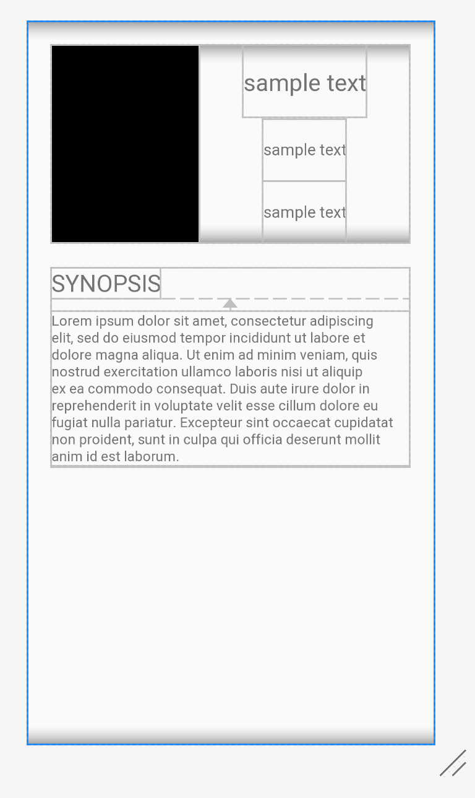

---

### 2. 데이터 가져오기

- 안드로이드 안에서 네트워크 통신을 할 때 써야 하는 복잡한 코드양을 줄여주는 retrofit2 라이브러리를 사용합니다.
- 링크 : [https://square.github.io/retrofit/](https://square.github.io/retrofit/)
- 만약 Retrofit 을 사용하지 않았을 경우 [java.net](http://java.net) 패키지 아래에 있는 HttpUrlConnection 클래스를 사용해서 통신을 해 주어야 합니다. 어떤 식의 코드인지 구경해 보고 싶으신 분은 해당 블로그를 참고해 주세요.
    - [https://mailmail.tistory.com/13](https://mailmail.tistory.com/13)
    - 참고로 위 블로그 안에서 쓰인 AsyncTask 라는 클래스는 안드로이드에서 background thread 의 비동기적인 처리를 위해 사용되는 아주 유명한 클래스였으나, 최근에 deprecated 되었습니다.
    - 네트워크 통신이 Main thread 에서 일어나는 것은 매우 좋지 않습니다. 왜냐하면 네트워크 처리가 다 끝날 때 까지 다른 thread 들이 블럭되어서 기본적인 UI조차 띄울 수 없는 상황이 되기 때문입니다. 예를 들면 카카오톡 쇼핑 탭을 켰는데 네트워크에서 쇼핑 정보들을 가져오느라 아예 앱이 다운되어 버리는 상황이 올 수 도 있는 경우입니다.
    - 따라서 네트워크 처리는 항상 백드라운드 쓰레드에서 처리를 하고, 뒤에서 작업이 다 끝난 후 `저 일 다 끝났어요, 여기 결과 가져왔어요` 하는 별도의 작업**(비동기 처리 - asynchronous work)**을 거쳐주어야 합니다. 이를 담당하는 것이 AsyncTask 클래스에 구현되어 우리가 override 해서 쓰는 `doInBackground` 와 `onPostExecute` 라는 함수였는데 이 기능이 **메모리 누수**의 원인이 되기 때문에 AysncTask 를 deprecate 시킨 것입니다. **(non-functional 한 클래스는 아니나, 사용을 권장하지 않는 클래스가 되어버렸다는 뜻입니다.)**
    - 메모리 누수는 parent process 가 종료되었음에도 불구하고 child process 는 계속 돌아다니며 메모리를 잡아먹는 현상입니다. parent 가 없으므로 chlid 에 대한 참조는 사라졌는데, 메모리 공간 어딘가에 `존재 하기만 하는` 상황이 되버린 상황입니다.
    - `아주 정교한 네트워크 처리`가 필요하지 않은 경우를 제외하고는 HttpUrlConnection 을 통한 네트워크 통신 처리는 개발자를 고통스럽게 합니다.

### Retrofit overview

- ***위에서 AsyncTask 가 deprecated 될 거라고 말씀드렸지만 이번 앱에서는 이 클래스를 사용합니 다. (?! ^^ ;;;)***
- 레트로핏을 사용하는 데 우선 필요한 것들은 세가지 입니다.
    1. API를 통해서 받아올 데이터를 Java 모델 클래스로 설계한다. 
    2. HTTP API를 Java의 Interface 로 정의한다. 
    3. Retrofit 객체와 1번에서 정의한 인터페이스를 이용해서 Base Url 과 endpoint 를 연결해준다. 
    4. 정보를 받아올 Client 클래스를 작성해서 [`retrofit2.Call`](http://retrofit2.Call) 클래스를 이용해 API가 주는 정보를 자바 객체들로 받아온다. 

- 무슨 말인지 지금은 하나도 모르시겠지만, 코드를 보면 이해하실 수 있을겁니다.

---

## *First things First!*

### *Retrofit Dependency 추가하기*

- 가장 먼저 지난 시간 recyclerview 디펜던시를 추가해줬던 **`build.gradle` 파일의 `dependencies`안에 아래의 라이브러리를 추가해 주세요.**

    implementation 'com.squareup.retrofit2:retrofit:2.6.1'
    implementation 'com.squareup.retrofit2:converter-gson:2.6.1'

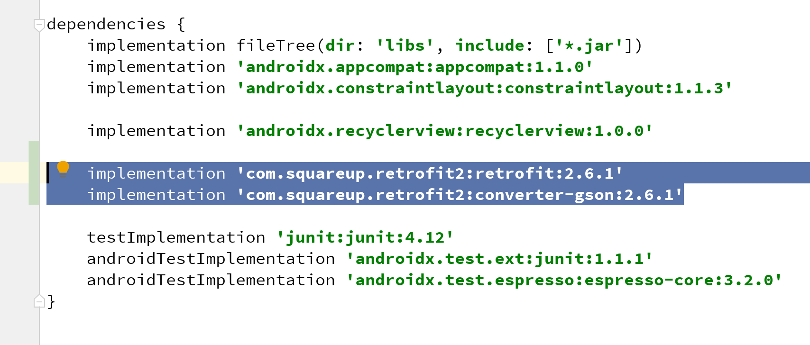

---

## MVVM architecture : 클래스 별 구조 이해하기

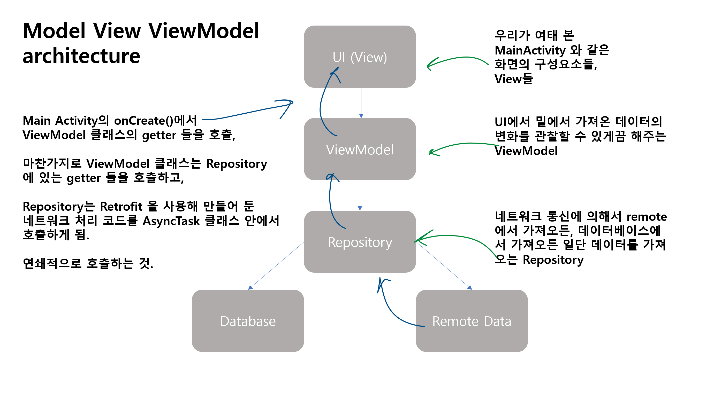

- 데이터를 가져오는 작업, UI를 데이터의 변화에 알맞게 업데이트 해주는 작업을 위해 MVVM 아키텍처를 사용합니다. ViewModel 이 데이터의 변화를 감지하고, View 를 업데이트 시켜준다 해서 MVVM아키텍처라는 이름을 사용합니다.
- **레이어별로 각자 맡고 있는 역할에 대해 기억**하셔야 합니다. MainActivity 의 onCreate() 라는 진입점에서는 **데이터 불러오기 + 화면에 띄우기** 함수를 호출합니다.
- **데이터 불러오기** 함수를 호출하면 ViewModel, Repository, Remote Data fetch 레이어를 타고 태려가서 retrofit 라이브러리를 활용하는 클래스 레이어까지 **함수 호출이 연쇄적으로** 이어지고, 데이터가 fetch 되었으면 **다시 레이어를 타고 올라와서 UI 에 반영**되는 식입니다.

- **Remote Data 라고 써져있는 부분을 더 상세하게 나누면 아래와 같습니다.**

- MovieServie 라는 인터페이스와 RetrofitInstanceBuilder 라는 클래스를 통해 우리가 원하는 URL에서 데이터를 가져올 수 있도록 셋팅을 해줍니다.
- 그런 후 MovieClient 라는 클래스에서 URL을 통해 데이터를 가져오는 로직을 `작성`합니다.
- 데이터를 가져오는 코드를 위의 세 클래스에서 다 작성하고 난 후에 **Repository 레이어에서 백그라운드 스레드로 fetchData 함수를 `실행`하게 됩니다.  이 실행 함수는 MainActivity의 onCreate 에서 불려질 수 있도록 ViewModel 레이어에서 다시 한 번 불리고, 최종적으로 Activity 클래스 안에서 ViewModel 의 객체를 만들어 myViewModel.fetchData() 와 같은 식으로 호출됩니다.**

---

## *Warming up*

### 0. 준비하기

- 지난 시간 The Movie Database 사이트에서 발급받은 API key를 복사해 주세요

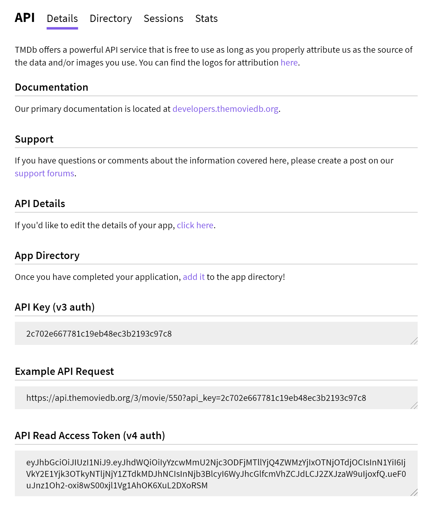

    https://api.themoviedb.org/3/movie/550?api_key=2c702e667781c19eb48ec3b2193c97c8
    
    -> 여기서 2c702e667781c19eb48ec3b2193c97c8 를 복사해 주세요. 

### 1. utils 패키지 만들기

- java 폴더 밑에 com.example.myapplication 과 같은 패키지 밑에 (패키지 이름은 상이할 수 있습니다)저희가 MainActivity.class 와 같은 여러 클래스 파일을 작성했는데요, **myapplication 패키지 밑에 `utils` 라는 패키지를 하나 더 만들어 주세요.**

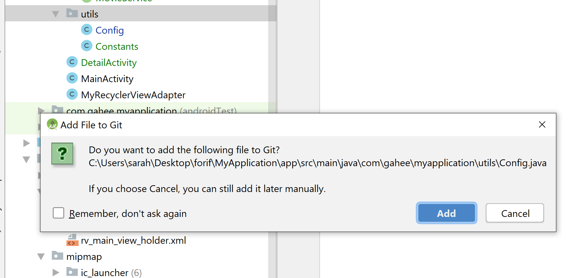

### utils 패키지 아래에 Config.class (DO NOT ADD!) 와 Constants.class 만들기

- New → class 를 해서 Config 와 Constants 라는 클래스 파일을 만들어 주시는데, **Config 파일은 절대 git 에 Add 하지 말아주세요.** 위 사진에 뜨는 창에서 Cancel을 누르시면 됩니다. 여기엔 API key를 넣을 건데, git 에 올리는 게 금지되어 있어서 만약 올리게 되시면 git에서 자동으로 detect 되어서 내리라고 이메일을 받으실 수 있습니다. **심각한 문제는 아니지만 production app 에서는 꼭 지켜야 하는 원칙이니 따로 빼놓도록 해 주세요.**

### Config.class

    package com.gahee.myapplication.utils;
    
    public class Config {
        public static final String API_KEY = "2c702e667781c19eb48ec3b2193c97c8"; 
    }

→ Config 클래스 파일 밑에 위처럼 API_KEY를 저장해 둡니다. 

### Constants.class

- Constants 클래스 파일 밑에는

    package com.gahee.myapplication.utils;
    
    public class Constants {
        public static final String BASE_URL = "https://api.themoviedb.org/3/";   
    }

→ 이렇게 BASE_URL 스트링을 만들어 줍니다. **이 base url 에서 여러 쿼리를 추가해서 정보를 요청할 수 있게 됩니다.** 

### 2. model 패키지 만들기 → MovieResponse.class , Movie.class 만들기

utils 패키지를 만들었던 것과 동일한 방법으로 model 패키지를 만들어 주시고, 그 안에 **MovieResponse 와 Movie 라는 클래스 파일을 만들어 주세요.** 

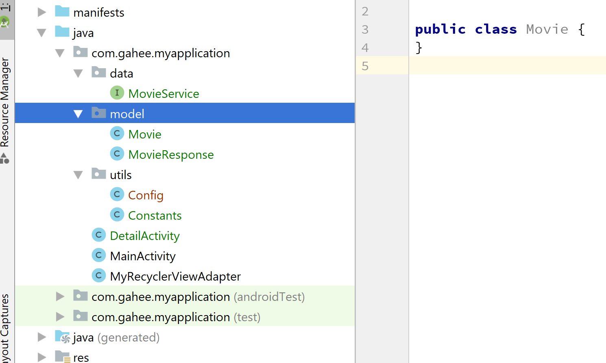

→ API에서 정보를 받아와서 **자바 코드로 바꾸는데 사용되는 클래**스입니다. 

### 3. POJO 작성하기 (Plain Old Java Object)

위에서 만든 Movie 클래스와 MovieResponse 클래스를 작성할 것입니다. 지난 시간에 API를 통해서 받아온 정보를 다시 보면, 

- [https://developers.themoviedb.org/3/movies/get-popular-movies](https://developers.themoviedb.org/3/movies/get-popular-movies)

    https://api.themoviedb.org/3/movie/popular
    ?api_key=2c702e667781c19eb48ec3b2193c97c8&language=en-US&page=1

→ 위의 URL로 요청을 날렸을 때 20개의 영화 데이터를 응답으로 받았었습니다. code beautify를 이용해서 다시 보면, 

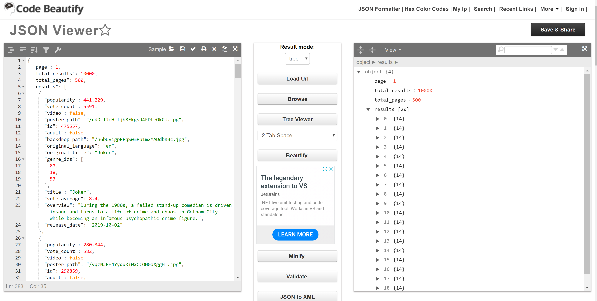

→ 이렇게 results 밑에 20개의 요소가 들어있고, 그 밑에 또 14개의 요소가 들어가 있는 것을 확인할 수 있었습니다. 

### 4. 이제 여기서 우리가 앱에 디스플레이 할 정보가 무엇인지 추려내야 합니다.

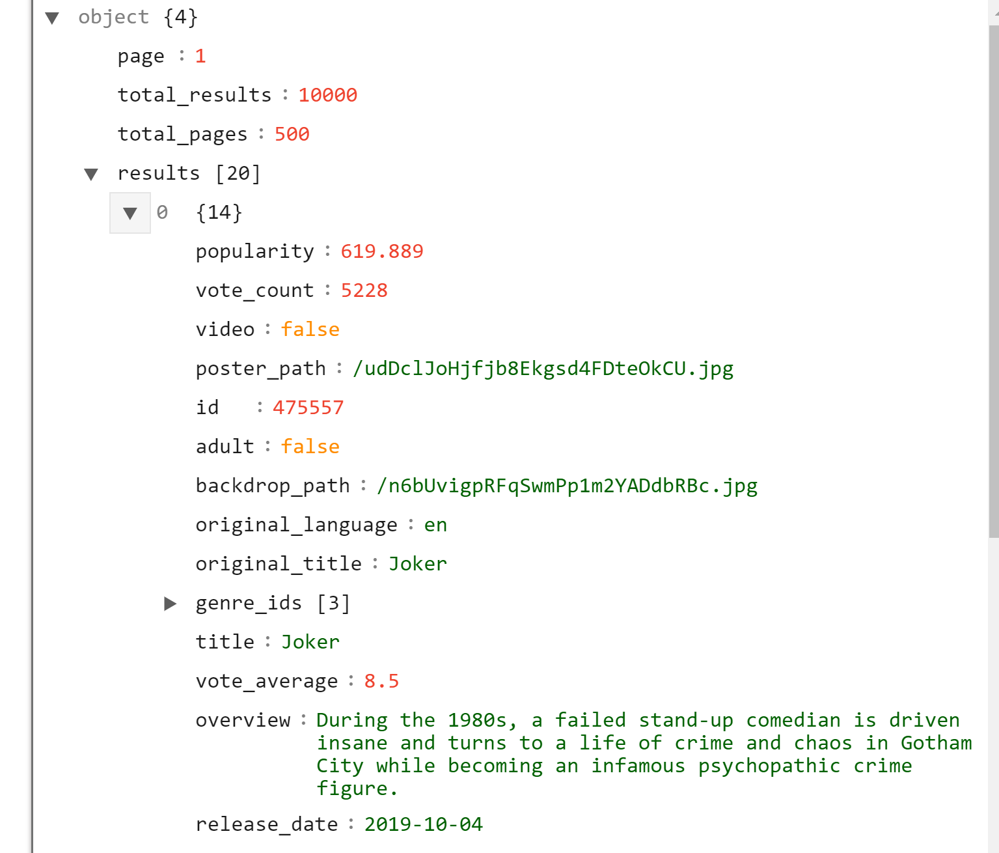

### 1) object → results

정보를 요청했을 때 가장 처음 반환되는 것은 크게 4개로 된 JSON 객체입니다. 우리는 이 4개 중에서 있는 results 라는 리스트가 필요하므로, 우선은 results 라는 리스트를 빼와야 합니다. 

### model 패키지 아래 MovieResponse 라는 POJO파일을 아래와 같이 작성합시다.

    package com.gahee.myapplication.model;
    import java.util.List;
    
    
    public class MovieResponse{
        
        List<Movie> results; //인스턴스 변수 
        
        MovieResponse(){ //생성자 
    
        }
    
        public List<Movie> getResults() { //getter 
                return results;
            }
    }

- 이렇게 변수, 생성자, getter (혹은 setter까지) 있는 자바 클래스를 많이 디자인 해 보셨을 겁니다. 이런 흔히 많이 본 Java 클래스를 POJO 라고 합니다.
- MovieResponse 에서는 results 라는 리스트를 받아올 것이므로, 위의 JSON 파일의 results를 자바 객체로변환할 때 우리가 만든 MovieResponse 라는 클래스 파일을 사용해서 변환해야 함을 알려주어야 합니다.

### Implement Parcelable (JSON에서 Java 객체로의 변환을 위해) & SerializedName annotation 추가하기

    package com.gahee.myapplication.model;
    
    import android.os.Parcel;
    import android.os.Parcelable;
    
    import com.google.gson.annotations.SerializedName;
    
    import java.util.List;
    
    
    public class MovieResponse implements Parcelable{
    
    
        @SerializedName("results")
        List<Movie> results;
    
        MovieResponse(){
    
        }
    
        protected MovieResponse(Parcel in) {
            results = in.createTypedArrayList(Movie.CREATOR);
        }
    
        @Override
        public void writeToParcel(Parcel dest, int flags) {
            dest.writeTypedList(results);
        }
    
        @Override
        public int describeContents() {
            return 0;
        }
    
        public static final Creator<MovieResponse> CREATOR = new Creator<MovieResponse>() {
            @Override
            public MovieResponse createFromParcel(Parcel in) {
                return new MovieResponse(in);
            }
    
            @Override
            public MovieResponse[] newArray(int size) {
                return new MovieResponse[size];
            }
        };
    
        public List<Movie> getResults() {
                return results;
            }
    
    
    }

**→ 코드에 대한 자세한 설명은 아래의 Movie 클래스에 대한 설명과 겹치므로, 아래에서 설명드리겠습니다.** 

### 2) results → poster_path, id, title, vote_average, overview, release_date ...

→ results 중에서 첫번째 요소를 펼쳐보면 poster_path, 영화 id, title, vote_average, overview, release_date 와 같은 정보들이 있습니다. 이 중에서 우리는 

    results[20] 리스트 요소 20개를 다 불러오는데, 각각에서 
    
    - poster_path
    - id
    - title
    - vote_average
    - overview 
    - release_date 
    
    => 이렇게 여섯개의 항목들을 가져올 것입니다. 

**→ 그렇다면 우리가 정의할 Movie 클래스 파일은 아래와 같이 구성이 됩니다. (POJO)**

    package com.gahee.myapplication.model;
    
    public class Movie {
    
    //Movie 라는 객체의 속성을 아래와 같이 정의합니다. 
        private String posterPath;
        private int id;
        private String title;
        private String voteAverage;
        private String overview;
        private String releaseDate;
    
    //getter 를 만들어 주었습니다. alt + insert 키를 누르시면 Getter라는 탭이 있는데, 
    //해당 탭을 누르면 아래와 같이 자동완성이 됩니다. 
        public String getPosterPath() {
            return posterPath;
        }
    
        public int getId() {
            return id;
        }
    
        public String getTitle() {
            return title;
        }
    
        public String getVoteAverage() {
            return voteAverage;
        }
    
        public String getOverview() {
            return overview;
        }
    
        public String getReleaseDate() {
            return releaseDate;
        }
    }

### 5. Movie / MovieResponse 객체를 Retrofit 이 알아보도록 만들어 주기

- 위에서 정의한 Movie 클래스의 형식으로 정보를 받아올 것인데요, 아직은 retrofit 이 우리의 자바 클래스를 알아보지 못하는 단계입니다.
- 어떤 속성이 어떤 JSON key 값에 해당하는지 표시해 주기 위해서 아래와 같이 `@SerializedName("JSON파일의Key값")` 형식으로 라벨을 달아줍니다. **(annotation이라는 개념입니다. 매우 어렵고 저도 잘 모르는 개념이라 라벨이라 칭하겠습니다.)**

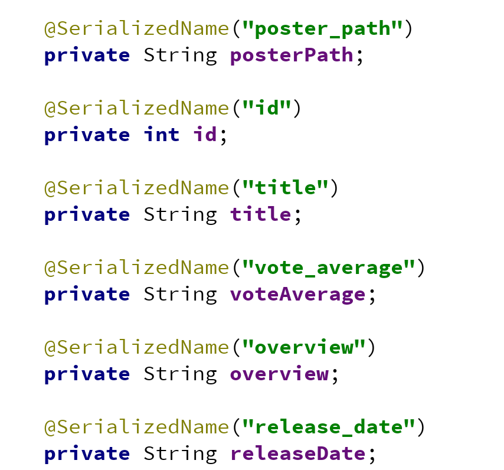

- 그 다음에 `public class Movie` 옆에 `implements Parcelable` 를 해주세요.
- **빨간 줄이 뜨는데, Movie 위에 커서를 올려두고 Alt + enter 를 눌러줍니다.**

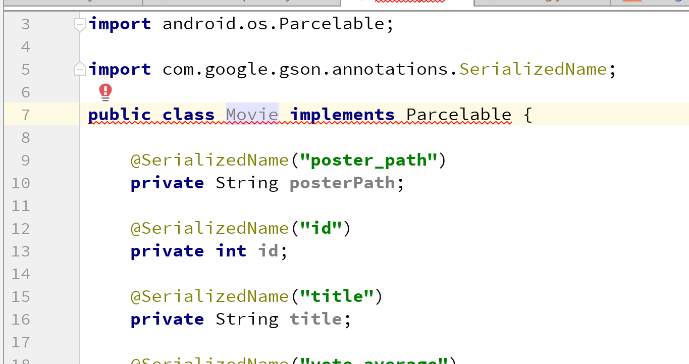

- **그러면 아래와 같이 `Add Parcelable Implementation` 이라는 탭이 뜹니다. 이걸 눌러주면 됩니다.**
- Parcelable 은 영화라는 custom 객체를 안드로이드가 알아볼 수 있도록 해주는 인터페이스 입니다. Parcelable 인터페이스를 구현한 클래스의 객체들은 화면 간 이동시에 정보를 전달해야 할 때 Movie 객체로 인식되지 않고 **Parcelable 이라는 객체로 인식 (객체지향의 다형성 개념입니다. - polymorphism)** 되어서 안드로이드가 일괄적으로 custom 데이터를 처리할 수 있도록 해줍니다. **(만약 Parcelable 로 custom 객체를 인식할 수 없다면 Movie 객체의 속성을 일일이 따로 화면1 에서 화면2로 전달해 주어야 할 것입니다.)**

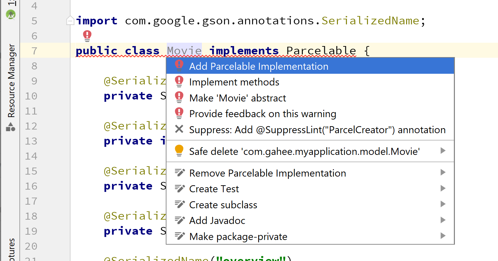

- 완성된 Movie class 파일입니다.

    package com.gahee.myapplication.model;
    
    import android.os.Parcel;
    import android.os.Parcelable;
    
    import com.google.gson.annotations.SerializedName;
    
    public class Movie implements Parcelable {
    
        @SerializedName("poster_path")
        private String posterPath;
        
        @SerializedName("id")
        private int id;
    
        @SerializedName("title")
        private String title;
    
        @SerializedName("vote_average")
        private String voteAverage;
    
        @SerializedName("overview")
        private String overview;
    
        @SerializedName("release_date")
        private String releaseDate;
    
        protected Movie(Parcel in) {
            posterPath = in.readString();
            id = in.readInt();
            title = in.readString();
            voteAverage = in.readString();
            overview = in.readString();
            releaseDate = in.readString();
        }
    
        @Override
        public void writeToParcel(Parcel dest, int flags) {
            dest.writeString(posterPath);
            dest.writeInt(id);
            dest.writeString(title);
            dest.writeString(voteAverage);
            dest.writeString(overview);
            dest.writeString(releaseDate);
        }
    
        @Override
        public int describeContents() {
            return 0;
        }
    
        public static final Creator<Movie> CREATOR = new Creator<Movie>() {
            @Override
            public Movie createFromParcel(Parcel in) {
                return new Movie(in);
            }
    
            @Override
            public Movie[] newArray(int size) {
                return new Movie[size];
            }
        };
    
        public String getPosterPath() {
            return posterPath;
        }
    
        public int getId() {
            return id;
        }
    
        public String getTitle() {
            return title;
        }
    
        public String getVoteAverage() {
            return voteAverage;
        }
    
        public String getOverview() {
            return overview;
        }
    
        public String getReleaseDate() {
            return releaseDate;
        }
    }

---

## *At Last! Retrofit!*

- **도표의 Remote Data 부분을 디자인 하는 단계입니다.**

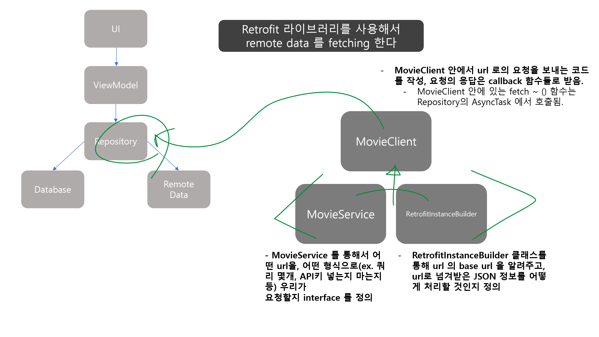

### 1. **우선 지난 시간에 확인했던 JSON데이터를 Http 동사로 (GET, POST 등등 ) 요청하는 인터페이스를 정의하겠습니다.**

- java 파일이 들어가있는 패키지 밑에 New → Package 를 해서 `data` 라는 패키지를 만들어 주세요.

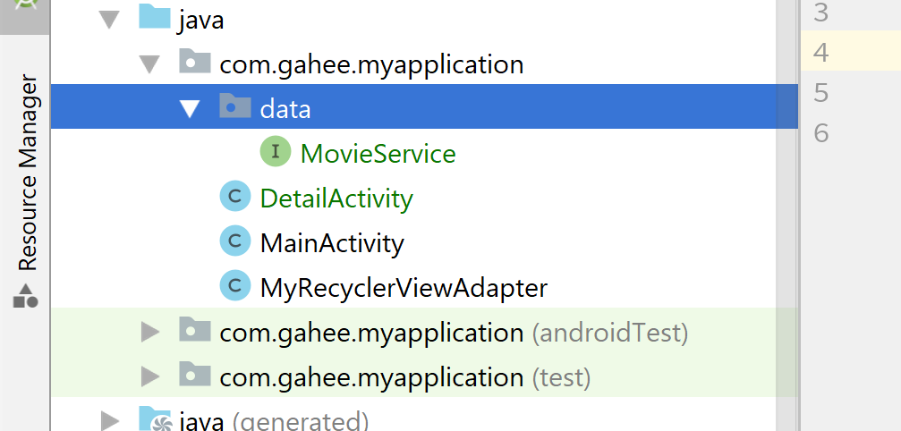

- data 패키지 밑에 밑에 New → class 를 통해서 `Kind` 를 Interface 로 설정해 주시고 MovieService 라는 인터페이스를 만들어 주세요

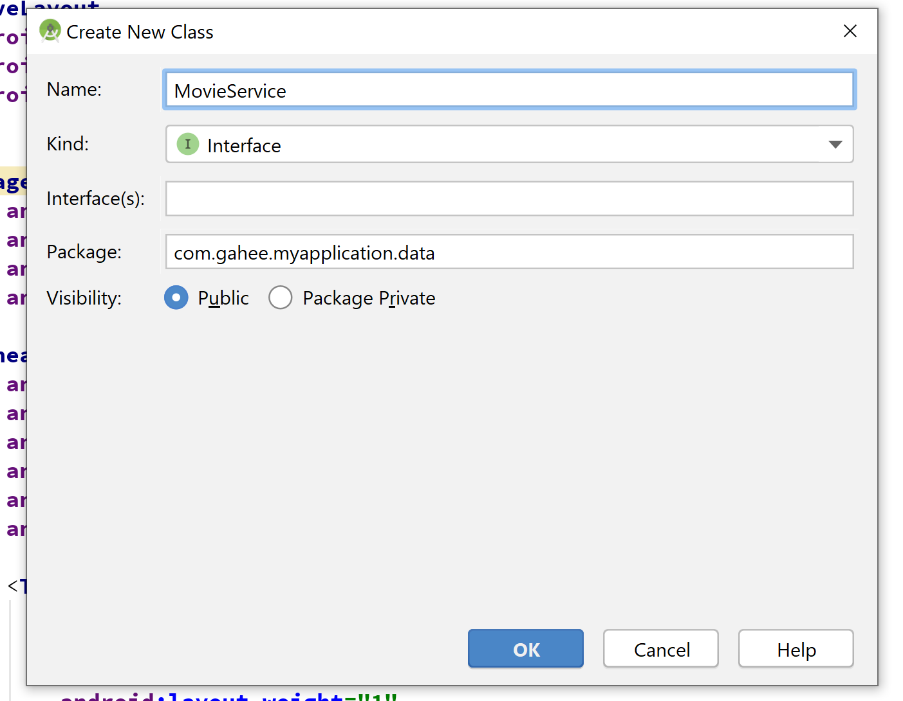

- 위의 인터페이스 안에 GET 요청을 날릴 수 있는 메소드를 정의하겠습니다.

    package com.gahee.myapplication.data;
    
    import com.gahee.myapplication.model.MovieResponse;
    
    import java.util.List;
    import java.util.Map;
    
    import retrofit2.Call;
    import retrofit2.http.GET;
    import retrofit2.http.Query;
    
    public interface MovieService {
        
        @GET("movie/popular")
        Call<MovieResponse> getPopularMovies(@Query("api_key") String api_key, Map<String, String> queries);
    
    }

- 하나 하나 살펴보면
- `@GET("movie/popular")` : GET 요청을 날릴건데, base url 에다가 movie/popular 이라는 것을 붙여서 해당 주소에 접근하겠다는 뜻입니다.
- `Call<MovieResponse>` : 여기서 Call 은 retrofit 의 네트워크 통신 결과 반환되는 타입입니다. MovieResponse 객체 속성 중 우리가 "results" 라는 키 값의 정보를 요청했다는 것을 SerializedName 어노테이션으로 알아차리고, 이에 해당하는 정보를 넘겨줍니다.
- `getPopularMovies(@Query("api_key") String api_key, Map<String, String> queries);` :
    - getPopularMovies 는 그냥 제가 정해준 메소드 이름입니다.
    - @Query("api_key") 는 `https://api.themoviedb.org/3/movie/popular
    ?api_key=2c702e667781c19eb48ec3b2193c97c8&language=en-US&page=1` 이 주소에서 `?api_key=` 라는 부분을 자바 코드로 적어준 것입니다. 쿼리로 api_key라는 속성이 있는데, 이 값에다가 String 형식으로 키를 넣어지겠다는 뜻입니다.
    - Map<String, String> 은 뒤에 잇따르는 `&language = en`  과 `&page=1` 이라는 쿼리를 Map으로 넣어주겠다는 뜻입니다. Hash 처럼 "langunage" : "en", "page" : "1" 이렇게 넣어 주겠다는 뜻입니다.

- [https://square.github.io/retrofit/](https://square.github.io/retrofit/) 에 있는 다큐먼트를 참고해서 다양한 형식의 URL 인터페이스를 작성할 수 있습니다.

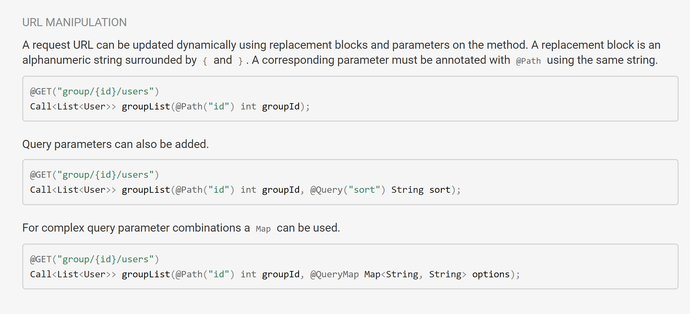

이상 MovieService 인터페이스 정의를 마쳤습니다.

---

### 2. Retrofit 객체 만들기

- **data 패키지 밑에 RetrofitInstanceBuilder 라는 클래스 파일을 작성해 줍니다.**

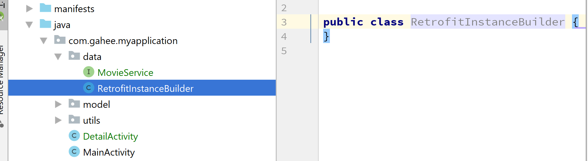

아래와 같이 코드를 작성해 줍시다. 

    package com.gahee.myapplication.data;
    
    import com.gahee.myapplication.utils.Constants;
    
    import retrofit2.Retrofit;
    import retrofit2.converter.gson.GsonConverterFactory;
    
    public class RetrofitInstanceBuilder {
        
    //(1)
        private static final Retrofit retrofit_popular_movies 
                = new Retrofit.Builder()
                .baseUrl(Constants.BASE_URL)
                .addConverterFactory(GsonConverterFactory.create())
                .build(); 
     //(2)
        private static final MovieService MOVIE_SERVICE = 
                retrofit_popular_movies.create(MovieService.class);
    
    //(3)
        public static MovieService getMovieService() {
            return MOVIE_SERVICE;
        }
        
    }

### (1) : Retrofit 객체를 Builder pattern 으로 만들어 주었습니다.

- builder 패턴은 클래스 안의 속성이 많아서 객체를 초기화 할 때 생성자가 너무 길어지는 경우 사용하는 패턴입니다.
- 예를들어 클래스 Student 안에 학생 이름, 학번, 듣는 과목, 등등등 속성이 50개 정도 정의가 되어있는 경우, 이 클래스를 사용하는 사람은 객체를 초기화 할 때 생성자에 속성을 50개씩 넣어주어야 하는 상황을 맞딱뜨릴 수 있습니다.
- 클래스를 사용하는 사람 입장에서 이 많은 속성을 다 기억하고 객체를 초기화 한다는 것은 말이 안되므로, 필요한 속성만 초기화 할 수 있도록 builder 를 사용합니다.
- new Retrofit.Builder() 를 호출하면 그 뒤에 `setter` 처럼 줄줄이로 속성을 셋팅할 수 있는 옵션들을 붙일 수 있습니다.
- 여기서는 base url, converter factory 를 설정해 주었습니다. 해당 base url를 사용할 것이며, JSON을 Java 객체로 변환해주는 GsonConverterFactory를 사용하겠다는 뜻입니다.

### (2) MovieService 인터페이스를 Retrofit 객체를 이용해서 retrofit 에게 인터페이스를 사용할 것임을 알려줍니다.

### (3) MovieService 의 getter 를 만들었습니다.

- ***retrofit 객체와 MOVIE_SERVICE 는 이제 위의 RetrofitInstanceBuilder 클래스를 통해서 접근하게 됩니다.***

---

### 3. Retrofit 객체를 이용해서 정보를 받아올 클래스인 MovieClient 클래스를 만듭니다.

- data 패키지 밑에 MovieClient 라는 클래스 파일을 만들어 주세요.

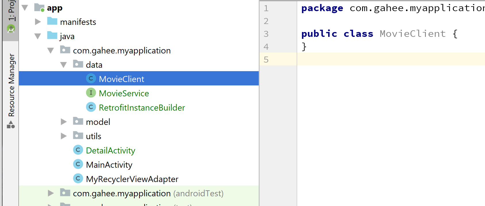

- **우선 utils 패키지 밑에 있는 Constants 클래스로 들어가 주시길 바랍니다.**
    - queries 라고 써 놓은 곳 밑의 스트링들을 붙여넣기 해 주세요.

    package com.gahee.myapplication.utils;
    
    public class Constants {
    
        public static final String BASE_URL = "https://api.themoviedb.org/3/";
    
        //queries
        public static final String KEY_LANGUAGE = "language";
        public static final String EN = "en-US";
        public static final String KEY_PAGE = "page";
        public static final String PAGE = "1";
    
    }

- **이제, `MovieClient` 클래스에 들어가서 아래의 코드를 넣어주세요**

    package com.gahee.myapplication.data;
    
    import android.util.Log;
    
    import androidx.lifecycle.MutableLiveData;
    
    import com.gahee.myapplication.model.Movie;
    import com.gahee.myapplication.model.MovieResponse;
    import com.gahee.myapplication.utils.Config;
    
    import java.util.HashMap;
    
    import retrofit2.Call;
    import retrofit2.Callback;
    import retrofit2.Response;
    
    import static com.gahee.myapplication.utils.Constants.EN;
    import static com.gahee.myapplication.utils.Constants.KEY_LANGUAGE;
    import static com.gahee.myapplication.utils.Constants.KEY_PAGE;
    import static com.gahee.myapplication.utils.Constants.PAGE;
    
    public class MovieClient {
    
        public static final String DEBUG_RETROFIT = "retrofit";
        private static final String TAG = "MovieClient";
    
        //MutableLiveData 는 일종의 Wrapper class 로, List<Movie> 라는
        //데이터에 변화가 생기면 이 변화를 UI에 바로 반영할 수 있도록 해줍니다.
        private MutableLiveData<MovieResponse> listMutableLiveData
            = new MutableLiveData<>();
    
        //MovieService 에서 인자값으로 Map<String, String> 을 지정한 것을 위한 HashMap 입니다.
        //HashMap 은 Map 인터페이스를 구현한 자료구조 입니다.
        private HashMap<String, String> queries = new HashMap<>();
    
        //이 클래스는 네트워크에서 정보를 가져오는 클래스로, 객체가 여러개 생기는 것을
        //방지해야 합니다. 이를 위해 Singleton pattern 으로 객체를 생성해 줍니다.
        private static MovieClient instance;
    
        //singleton pattern
        public static MovieClient getInstance(){
            if(instance == null){
                //객체가 null 일 경우에만 초기화 -> 객체가 한개만 생기도록 !
                instance = new MovieClient();
            }
            return instance;
        }
    
        //Service 인터페이스를 이용해 정보를 가져올 것입니다.
        private MovieService movieService = RetrofitInstanceBuilder.getMovieService();
    
        //영화 정보를 가져오는 메소드를 정의합니다.
        public void fetchPopularMoviesClient(){
    
            //쿼리가 HashMap 에 담겨있지 않다면 쿼리를 append 해줍니다.
            if(queries == null || queries.size() == 0){
                appendQueries();
            }
    
            //Service 인터페이스에서 정의한 get 메소드를 사용해 Call 객체를 반환받습니다.
            //Call 객체에 우리가 필요한 Movie객체의 List가 담겨져 있습니다.
            final Call<MovieResponse> popularMoviesCall
                    = movieService.getPopularMovies(Config.API_KEY, queries);
    
    
            Callback<MovieResponse> popularMoviesCallback
                    = new Callback<MovieResponse>() {
                @Override
                public void onResponse(Call<MovieResponse> call, Response<MovieResponse> response) {
                    //응답이 성공적이었을 때 반응하는 함수입니다.
                    //위에서 정의한 LiveData 에 response 로 받아온 것을 setValue 해줍니다.
                    listMutableLiveData.setValue(response.body());
    
                }
    
                @Override
                public void onFailure(Call<MovieResponse> call, Throwable t) {
                    //응답이 실패했을 때 반응하는 함수입니다.
                    //에러 메시지를 확인하기 위해 Log 를 남겨둡시다.
                    Log.d(DEBUG_RETROFIT, "On Failure : " + t.getMessage());
                }
            };
    
            //Call 객체에다가 위의 Callback 을 넣어주면
            //Service 에서 정의한 get 메소드가 Http GET 요청을 정의된 주소로 날리면서
            //응답을 받아오고, 해당 응답이 성공적일 경우 위의 onResponse 함수가 반응하면서
            //우리에게 필요한 정보를 넘겨줍니다.
            popularMoviesCall.enqueue(popularMoviesCallback);
        }
    
        //위의 Call 에서 받아올 데이터를 리턴해주는 getter 를 작성합니다.
        public MutableLiveData<MovieResponse> getListMutableLiveData() {
            return listMutableLiveData;
        }
    
        //쿼리를 append 하는 메소드를 따로 정의하였습니다.
        //Constants 클래스 에서 필요한 String 값들을 정의해두고 import 해서 사용합니다.
        private HashMap<String, String> appendQueries() {
            queries.put(KEY_LANGUAGE, EN);
            queries.put(KEY_PAGE, PAGE);
            return queries;
        }
    
    }

- Client 는 정보를 받아오는 일을 담당하는 클래스 입니다. 따라서 **받아온 정보를 저장할 객체**가 하나 필요하고, 정보를 받아왔을 때 **성공했는지 실패했는지도** 알려주어야 합니다.
- 1) 받아온 정보를 저장할 객체 **MutableLiveData<MovieResponse> 타입**

      private MutableLiveData<MovieResponse> listMutableLiveData
            = new MutableLiveData<>();

→ Mutable 이라는 것은 변할 수 있다는 뜻이고 LiveData 는 데이터의 변화를 observe 할 수 있는 종류의 데이터 라는 뜻입니다. 따라서 MovieResponse 라는 클래스에 JSON에서 받아온 "results" 아래의 리스트 요소들이 변하는 것을 관찰하고, 그에 맞에 UI를 업데이트 할 수 있습니다. 

→ MovieResponse 클래스 안에는 List<Movie> 가 있다는 것을 기억해 주세요. 

- 2) 정보를 받아왔을 때 성공 or 실패

    final Call<MovieResponse> popularMoviesCall
            = movieService.getPopularMovies(Config.API_KEY, queries);
    
    
    Callback<MovieResponse> popularMoviesCallback
            = new Callback<MovieResponse>() {
        @Override
        public void onResponse(Call<MovieResponse> call, Response<MovieResponse> response) {
            listMutableLiveData.setValue(response.body());
    
        }
    
        @Override
        public void onFailure(Call<MovieResponse> call, Throwable t) {
            Log.d(DEBUG_RETROFIT, "On Failure : " + t.getMessage());
        }
    };
    popularMoviesCall.enqueue(popularMoviesCallback);
    }

→ MovieServie 인터페이스 안에 정의해놓은 getPopularMovies 의 응답으로 반환받는 것은 Call이라는 객체 안에 있는 MovieResponse 입니다. 

→ Callback 이라는 것은 영화 API로의 정보 요청을 했을 때 그 결과를 받아주고, 결과에 따라 (성공 혹은 실패) 다른 메소드를 호출시키는 구조로 이루어져 있습니다. 

- Callback의 onResponse 함수를 보면 인자값으로 response 를 받습니다. 이 응답 안에 우리가 원하는 정보인 MovieResponse 가 담겨있으며, 이는 즉 List<Movie> 를 반환해 준 것과 동일합니다.

        @Override
        public void onResponse(Call<MovieResponse> call, Response<MovieResponse> response) {
            listMutableLiveData.setValue(response.body());
    
        }

→ 결과를 담을 MutableLiveData 에다가 setValue 함수를 호출해서 response 의 body()를 저장해 줍니다.

- API 사용을 위한 Service 객체

     private HashMap<String, String> queries = new HashMap<>();
    
    // 중간 생략 
    
      final Call<MovieResponse> popularMoviesCall
                    = movieService.getPopularMovies(Config.API_KEY, queries);
    
    // 생략 
    
        private HashMap<String, String> appendQueries() {
            queries.put(KEY_LANGUAGE, EN);
            queries.put(KEY_PAGE, PAGE);
            return queries;
    }

→ service 에서 정의해놓은 API를 사용하기 위해 getMovieService()로 호출을 해서 객체를 생성한 후, API를 사용합니다. 

→ movieService.getPopularMovies(); 안에는 인터페이스 안에 정의해 놓은 대로 String api_key 와 Map<String, String> queries 를 넣어야 합니다. API_KEY는 Config 클래스 안에 정의해 놓았기 때문에 저렇게 불러서 쓰고, queries 는 아래의  appendQueries 함수를 실행시켜 Map 안에 넣어줍니다. Map 인터페이스를 사용한 HashMap 자료구조를 사용해서 객체를 만들어 사용했습니다. 

---

### 4. Repository 클래스 만들기

- 도표의 Repository를 디자인 하는 부분입니다.

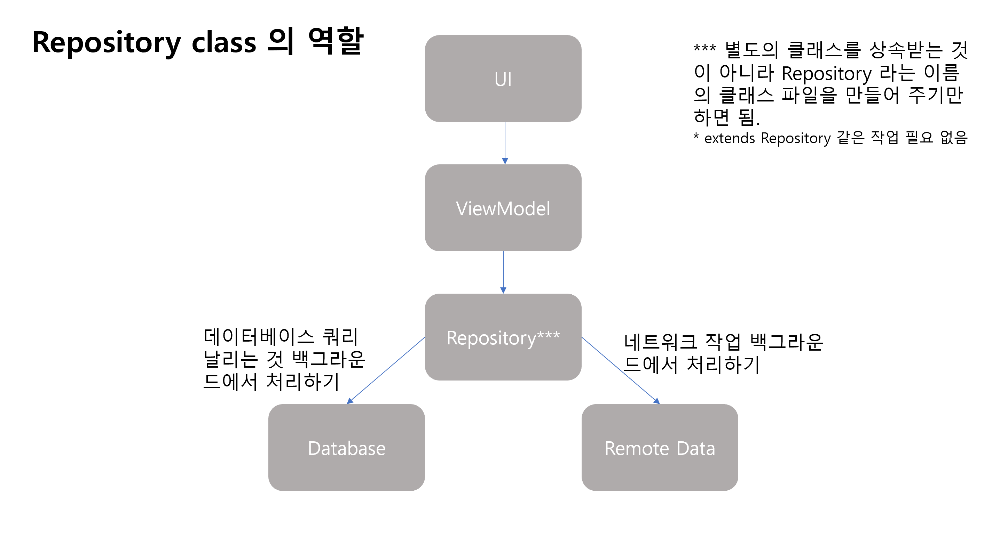

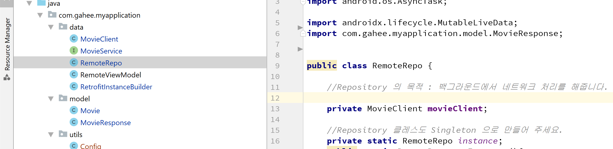

- data 패키지 밑에 **RemoteRepo 라는 클래스 파일을 작성해서 아래의 코드를 넣습니다.**

    package com.gahee.myapplication.data;
    
    import android.os.AsyncTask;
    
    import androidx.lifecycle.MutableLiveData;
    import com.gahee.myapplication.model.MovieResponse;
    
    
    public class RemoteRepo {
    
        //Repository 의 목적 : 백그라운드에서 네트워크 처리를 해줍니다.
    
        private MovieClient movieClient;
    
        //Repository 클레스도 Singleton 으로 만들어 주세요.
        private static RemoteRepo instance;
        public static RemoteRepo getInstance(){
            if(instance == null){
                instance = new RemoteRepo();
            }
            return instance;
        }
    
        public RemoteRepo(){
            //위의 RemoteRepo 인스턴스가 만들어 지면서 client 클래스의 객체도
            //동시에 생성됩니다.
            movieClient = MovieClient.getInstance();
        }
    
        public void fetchPopularMoviesAsync(){
            // AsyncTask 클래스 객체를 만들어서 execute() 시켜줍니다.
            new PopularMoviesAsync(movieClient).execute();
        }
    
    
        //Client 에서 정의된 getter 를 호출합니다.
        public MutableLiveData<MovieResponse> getPopularMoviesRepo(){
            return movieClient.getListMutableLiveData();
        }
    
    
    
        //Background thread 로 영화 데이터를 가져오는 함수를 실행합니다.
        static class PopularMoviesAsync extends AsyncTask<Void, Void, Void> {
    
            MovieClient movieClient;
    
            private PopularMoviesAsync(MovieClient m){
                //Client 객체를 생성자를 통해서 받아옵니다.
                movieClient = m;
            }
    
            @Override
            protected Void doInBackground(Void... voids) {
                //Client 클래스에서 작성한 fetch 메소드 입니다.
                movieClient.fetchPopularMoviesClient();
                return null;
            }
        }
    
    }

- 코드를 부분별로 나눠서 살펴보면 아래와 같습니다.

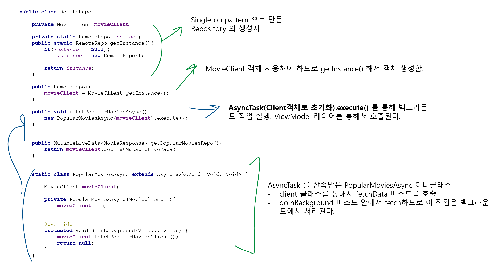

- **MovieClient 에서 작성한 Data fetch 함수를 AsyncTask 의 doInBackground 함수 안에서 실행시키도록 한 것입니다.**

---

### 5. ViewModel 클래스 만들기

- [**gradle.build](http://gradle.build) 파일의 dependencies 밑에 아래의 lifecycle extension 을 추가해 줍니다. ViewModel 을 사용하기 위해 필요한 디펜던시입니다.**

    implementation 'androidx.lifecycle:lifecycle-extensions:2.1.0'

- data 패키지 아래에 RemoteViewModel 이라는 클래스를 작성해 줍니다.
- **RemoteViewModel 클래스는 ViewModel 클래스를 상속받습니다.**

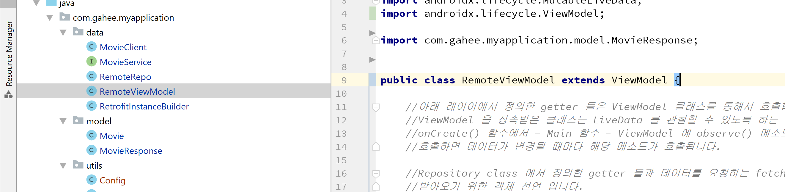

- 클래스를 작성한 후 아래의 코드를 넣어주세요

    package com.gahee.myapplication.data;
    
    import androidx.lifecycle.MutableLiveData;
    import androidx.lifecycle.ViewModel;
    
    import com.gahee.myapplication.model.MovieResponse;
    
    
    public class RemoteViewModel extends ViewModel {
    
        //아래 레이어에서 정의한 getter 들은 ViewModel 클래스를 통해서 호출합니다.
        //ViewModel 을 상속받은 클래스는 LiveData 를 관찰할 수 있도록 하는 클래스로
        //onCreate() 함수에서 - Main 함수 - ViewModel 에 observe() 메소드를
        //호출하면 데이터가 변경될 때마다 해당 메소드가 호출됩니다.
    
        //Repository class 에서 정의한 getter 들과 데이터를 요청하는 fetch 함수를
        //받아오기 위한 객체 선언 입니다.
        private final RemoteRepo remoteRepo;
    
        //ViewModel 클래스가 초기화 되면서 repository 클래스도 초기화 됩니다.
        //연쇄적으로 Repository 클래스 안에 있는 Client 클래스도 초기화 됩니다.
        public RemoteViewModel(){
            remoteRepo = RemoteRepo.getInstance();
        }
    
        //LiveData 를 가져오는 getter 의 layer 를 한단계 더 만듭니다.
        public MutableLiveData<MovieResponse> getPopularMovies(){
            return remoteRepo.getPopularMoviesRepo();
        }
    
        //네트워크 처리를 시작시키는 메소드를 호출합니다.
        public void fetchPopularMoviesFromRemote(){
            remoteRepo.fetchPopularMoviesAsync();
        }
    
    
    }

- 아래의 도표를 다시 상기해 주세요.

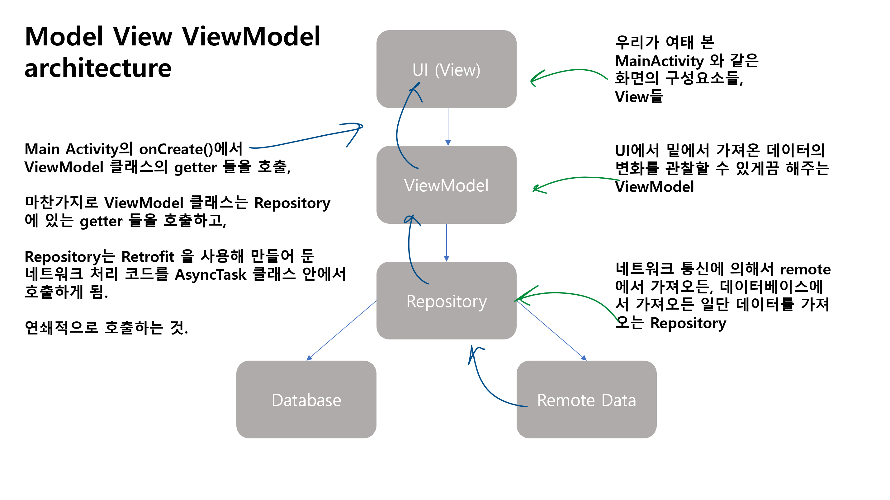

- ViewModel 클래스에서는 repository 에 정의해 놓은 fetch 함수와, fetch 를 통해서 얻은 데이터를 담은 MutableLiveData 에 대한 getter 를 작성해야 합니다. 윗 레이어부터 아래까지 함수를 연쇄적으로 호출하기 위함입니다.

---

### 6. MainActivity 의 onCreate() 함수에서 ViewModel 클래스를 초기화하고 log에 데이터를 출력합니다

- MainActivity의 onCreate() 위에 ViewModel 클래스를 선언해 주세요.

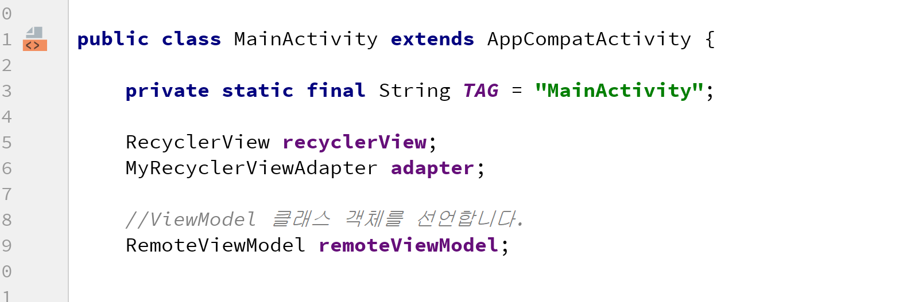

- onCreate() 메소드 안에서 ViewModel 객체를 초기화 해준 후, ViewModel 레이어의 fetchData 메소드를 (여기서는 `fetchPopularMoviesRemote()`) 호출하여 밑의 레이어까지 연쇄적으로 fetch 호출이 일어나도록 해줍니다.
- 그리고 마지막으로 LiveData 에 observe() 메소드를 걸어서 MovieResponse 객체를 Log 에 출력합니다.

    @Override
        protected void onCreate(Bundle savedInstanceState) {
            super.onCreate(savedInstanceState);
            setContentView(R.layout.activity_main);
    
            recyclerView = findViewById(R.id.rv_main);
            adapter = new MyRecyclerViewAdapter(this, generateDummy());
    
            recyclerView.setAdapter(adapter);
            recyclerView.setHasFixedSize(true);
            recyclerView.setLayoutManager(new LinearLayoutManager(this));
    //        recyclerView.setLayoutManager(new GridLayoutManager(this, 2));
    
    
            //onCreate() 안에서 remoteViewModel 객체를 초기화 해줍니다.
            remoteViewModel = ViewModelProviders.of(this).get(RemoteViewModel.class);
    
            //remoteViewModel 안의 네트워크 코드를 호출합니다.
            //Client 인 우리가 영화 정보를 받아오게 되었습니다 !
            remoteViewModel.fetchPopularMoviesFromRemote();
    
            //이제 원격에서 fetch 를 했으니 getter 로 정보를 받아와서 observer
            //로 관찰합니다.
            remoteViewModel.getPopularMovies().observe(this, new Observer<MovieResponse>() {
                @Override
                public void onChanged(MovieResponse response) {
                    //데이터가 처음으로 불려 왔을 때, 네트워크 콜이 다시 이루어 졌을 때
                    //onChanged 함수가 호출됩니다.
    
                    //정보가 제대로 불려졌는지 확인 차 로그로 출력해 봅시다.
                    List<Movie> movies = response.getResults();
    
                    for(int i = 0; i < movies.size(); i++){
                        Log.d(TAG, "onChanged: "
                        + "\nMovie Id : " + movies.get(i).getId()
                        + "\nMovie Title : " + movies.get(i).getTitle()
                        + "\nPoster Path : " + movies.get(i).getPosterPath()
                        + "\nOverview : " + movies.get(i).getOverview()
                        + "\nRelease Date : " + movies.get(i).getReleaseDate()
                        + "\nVote Average : " + movies.get(i).getVoteAverage()
                        );
                    }
                }
            });
        }

- shift + F10 을 해주시면 (에뮬레이터가 설치가 되어있는 경우) 아래와 같이 Logcat 칸에 정보가 찍히는 것을 확인할 수 있습니다.
- 혹은 탭 우측 상단의 Run 버튼을 눌러주세요 (초록색 삼각형 버튼)

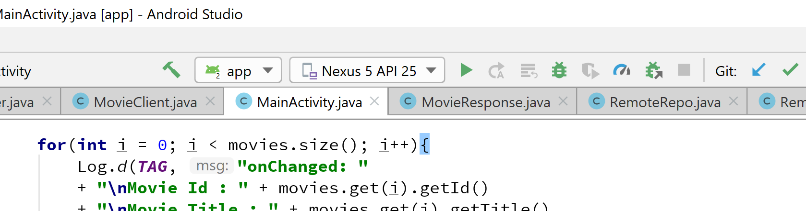

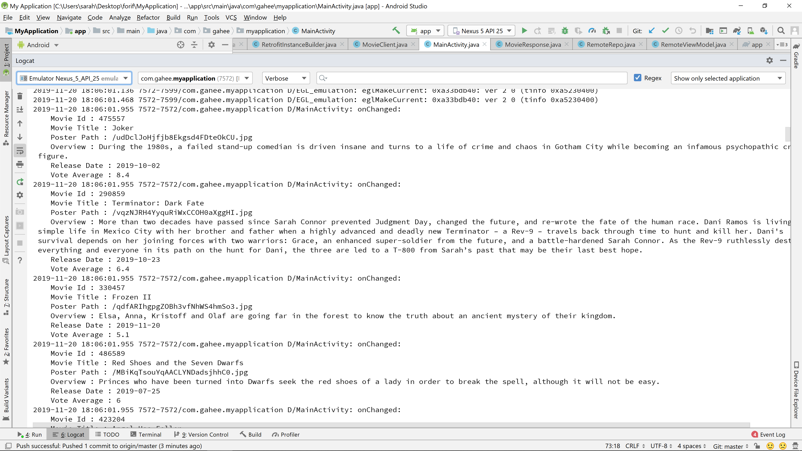

---

## MainActivity 의 RecyclerView 에 영화 정보 띄우기

- 지난 시간에 만들었던 dummy 데이터를 지워줍니다.

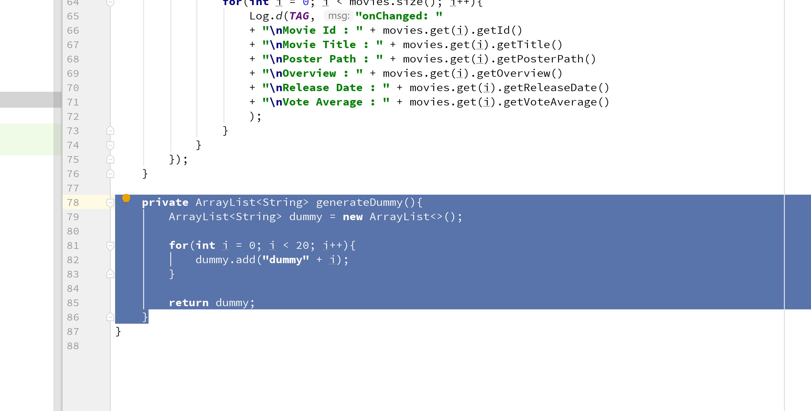

- 그리고 RecyclerView 를 셋팅했던 코드를 아래와 같이 onChanged 메소드 안에 넣어줍니다.

    @Override
      protected void onCreate(Bundle savedInstanceState) {
          super.onCreate(savedInstanceState);
    			setContentView(R.layout.activity_main);
    
    recyclerView = findViewById(R.id.rv_main);
    
    remoteViewModel = ViewModelProviders.of(this).get(RemoteViewModel.class);
    remoteViewModel.fetchPopularMoviesFromRemote();
    
    remoteViewModel.getPopularMovies().observe(this, new Observer<MovieResponse>() {
        @Override
        public void onChanged(MovieResponse response) {
    
            List<Movie> movies = response.getResults();
    
            adapter = new MyRecyclerViewAdapter(MainActivity.this, (ArrayList<Movie>) movies);
    
            recyclerView.setAdapter(adapter);
            recyclerView.setHasFixedSize(true);
            recyclerView.setLayoutManager(new LinearLayoutManager(MainActivity.this));
    
              }
          });
      }

- Context 를 넣는 부분에 MainActivity.this 라고 한 것은, 현재 new Observer <MovieResponse>(){  } 안에서 this 를 할 경우 this가 Observer 인터페이스를 가리키게 되기 때문에 명확하게 MainActivity가 내가 원하는 this 이다를 표시하기 위해 적어준 것입니다.

- **또한 MyRecyclerViewAdapter  클래스를 아래와 같이 수정해 주어야 합니다.**
    - ArrayList <String> 대신에 ArrayList <Movie> 를 받도록 바꾸고
    - 생성자의 매개변수도 이에 맞게 바꾸고
    - getItemCount () 함수 안의 return 값도 movies.size() 로 바꿔주어야 합니다.

    package com.gahee.myapplication;
    
    import android.content.Context;
    import android.view.LayoutInflater;
    import android.view.View;
    import android.view.ViewGroup;
    import android.widget.TextView;
    
    import androidx.annotation.NonNull;
    import androidx.recyclerview.widget.RecyclerView;
    
    import com.gahee.myapplication.model.Movie;
    
    import java.util.ArrayList;
    
    public class MyRecyclerViewAdapter extends RecyclerView.Adapter<MyRecyclerViewAdapter.MyViewHolder> {
    //정보를 뿌려주는 애
    
        Context context;
        ArrayList<Movie> movies; 
    
        MyRecyclerViewAdapter(Context context, ArrayList<Movie> movies){
            //정보를 생성자로 넘긴다 !
            this.context = context; //Main Activity 에서 넘어오는 것임을 알려줌
            this.movies = movies; //정보
        }
    
        @NonNull
        @Override
        public MyViewHolder onCreateViewHolder(@NonNull ViewGroup parent, int viewType) {
            //액자 레이아웃 만들기
            View view = LayoutInflater.from(context).inflate(R.layout.rv_main_view_holder, parent, false);
            return new MyViewHolder(view);
        }
    
        @Override
        public void onBindViewHolder(@NonNull MyViewHolder holder, int position) {
            //여기서 뷰홀더에 position 별로 데이터 뿌려줌
    
        }
    
        @Override
        public int getItemCount() {
            //넘어오는 정보의 개수
            return movies.size();
        }
    
        class MyViewHolder extends RecyclerView.ViewHolder{
    //액자
            TextView textView;
    
            public MyViewHolder(@NonNull View itemView) {
                super(itemView);
                textView = itemView.findViewById(R.id.tv_main_view_holder_text);
            }
        }
    }

- `**rv_main_view_holder` 의 레이아웃을 아래와 같이 수정해 줍니다.**

    <?xml version="1.0" encoding="utf-8"?>
    <LinearLayout xmlns:android="http://schemas.android.com/apk/res/android"
        android:orientation="vertical"
        android:layout_margin="18dp"
        android:layout_width="match_parent"
        android:layout_height="@dimen/main_view_holder_h">
    
    <!--TODO 33 : 뷰홀더 디자인을 아래와 같이 수정해 줍니다. -->
    
        <RelativeLayout
            android:id="@+id/main_relative"
            android:layout_width="match_parent"
            android:layout_height="wrap_content">
    
            <ImageView
                android:id="@+id/img_main_movie_poster"
                android:layout_width="150dp"
                android:layout_height="200dp"/>
    
            <LinearLayout
                android:layout_width="match_parent"
                android:layout_height="200dp"
                android:gravity="center"
                android:layout_toEndOf="@id/img_main_movie_poster"
                android:orientation="vertical">
    
                <TextView
                    android:id="@+id/tv_main_movie_title"
                    android:textSize="@dimen/text_size_medium"
                    android:gravity="center"
                    android:layout_width="wrap_content"
                    android:layout_height="wrap_content"
                    android:text="@string/sample_text" />
    
                <TextView
                    android:id="@+id/tv_main_movie_release_date"
                    android:textSize="@dimen/text_size_small"
                    android:layout_width="wrap_content"
                    android:layout_height="wrap_content"
                    android:text="@string/sample_text" />
    
                <TextView
                    android:id="@+id/tv_main_movie_vote_average"
                    android:textSize="@dimen/text_size_small"
                    android:layout_width="wrap_content"
                    android:layout_height="wrap_content"
                    android:text="@string/sample_text" />
    
                <TextView
                    android:id="@+id/tv_main_movie_synopsis"
                    android:textSize="@dimen/text_size_small"
                    android:layout_width="wrap_content"
                    android:layout_height="wrap_content"
                    android:maxLines="3"
                    android:ellipsize="end"
                    android:text="@string/sample_text" />
    
            </LinearLayout>
    
        </RelativeLayout>
    
    
        <TextView
            android:id="@+id/tv_main_click_me"
            android:layout_gravity="center"
            android:textSize="@dimen/text_size_small"
            android:text="@string/click_me"
            android:layout_width="wrap_content"
            android:layout_height="wrap_content"/>
    
    
    </LinearLayout>

- strings.xml에다가 아래의 스트링을 추가해 주세요

    <string name="click_me">Click for Details</string>

- 그리고 다시 Adapter 클래스로 돌아와 위의 View 들을 코드로 연결시켜 줍니다. 우선 **onBindViewHolder 에서 이미지뷰를 제외하고 나머지 텍스트뷰에 영화 정보를 띄워줍니다.**

    package com.gahee.myapplication;
    
    import android.content.Context;
    import android.view.LayoutInflater;
    import android.view.View;
    import android.view.ViewGroup;
    import android.widget.ImageView;
    import android.widget.TextView;
    
    import androidx.annotation.NonNull;
    import androidx.recyclerview.widget.RecyclerView;
    
    import com.gahee.myapplication.model.Movie;
    
    import java.util.ArrayList;
    
    public class MyRecyclerViewAdapter extends RecyclerView.Adapter<MyRecyclerViewAdapter.MyViewHolder> {
    //정보를 뿌려주는 애
    
        Context context;
        ArrayList<Movie> movies;
    
        MyRecyclerViewAdapter(Context context, ArrayList<Movie> movies){
            //정보를 생성자로 넘긴다 !
            this.context = context; //Main Activity 에서 넘어오는 것임을 알려줌
            this.movies = movies; //정보
        }
    
        @NonNull
        @Override
        public MyViewHolder onCreateViewHolder(@NonNull ViewGroup parent, int viewType) {
            //액자 레이아웃 만들기
            View view = LayoutInflater.from(context).inflate(R.layout.rv_main_view_holder, parent, false);
            return new MyViewHolder(view);
        }
    
        @Override
        public void onBindViewHolder(@NonNull MyViewHolder holder, int position) {
            //여기서 뷰홀더에 position 별로 데이터 뿌려줌
            //생성자로 넘겨받은 movie 데이터를 연결해 줍시다.
    
            Movie movie = movies.get(position);
            holder.tvMovieTitle.setText(movie.getTitle());
            holder.tvMovieReleaseDate.setText(movie.getReleaseDate());
            holder.tvMovieVoteAverage.setText(movie.getVoteAverage());
            holder.tvMovieSynopsis.setText(movie.getOverview());
    
            //Glide 사용해서 이미지 띄우기
    
        }
    
        @Override
        public int getItemCount() {
            //넘어오는 정보의 개수
            return movies.size();
        }
    
        class MyViewHolder extends RecyclerView.ViewHolder{
    //액자
            ImageView imgMoviePoster;
            TextView tvMovieTitle;
            TextView tvMovieVoteAverage;
            TextView tvMovieReleaseDate;
            TextView tvMovieSynopsis;
    
    
    
            public MyViewHolder(@NonNull View itemView) {
                super(itemView);
    
                imgMoviePoster = itemView.findViewById(R.id.img_main_movie_poster);
                tvMovieTitle = itemView.findViewById(R.id.tv_main_movie_title);
                tvMovieVoteAverage = itemView.findViewById(R.id.tv_main_movie_vote_average);
                tvMovieReleaseDate = itemView.findViewById(R.id.tv_main_movie_release_date);
                tvMovieSynopsis = itemView.findViewById(R.id.tv_main_movie_synopsis);
            }
        }
    }

- 이렇게 하고 나서 run 을 누르면 (shift + F10) 아래와 같이 리스트에 정보가 업데이트 되었습니다.

    

    **→ 폰트는 제 핸드폰 폰트 설정대로 뜬 것입니다.** 

### Glide 라이브러리로 사진 띄우기

- poster path 로 받은 값은 Base url 을 제외한 나머지 스트링입니다. 따라서 사진을 어떤 base url 로 띄워야 하는지 다큐먼트를 확인해 봅시다.
- [https://developers.themoviedb.org/3/getting-started/images](https://developers.themoviedb.org/3/getting-started/images)
- 사이트에 들어가면 이미지를 어떤 url로 띄워야 하는지 설명이 되어있습니다.

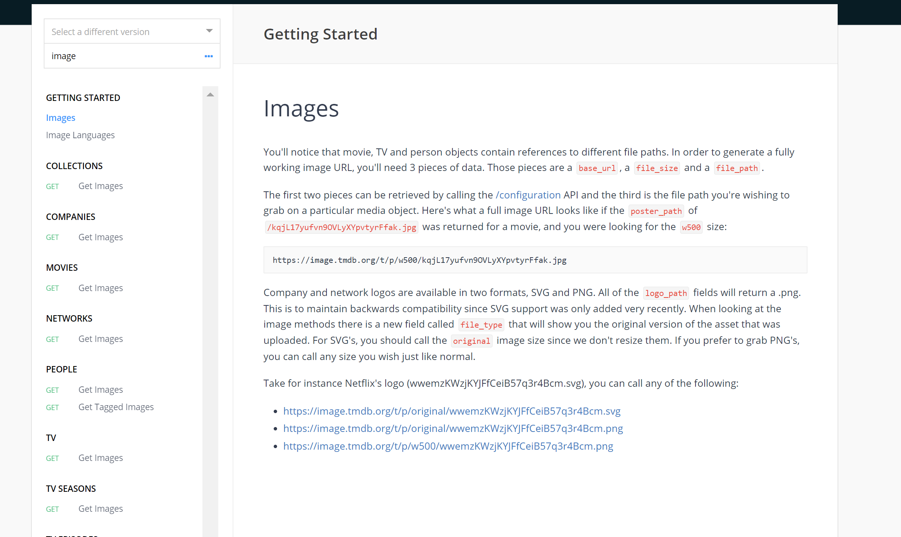

    https://image.tmdb.org/t/p/w500/kqjL17yufvn9OVLyXYpvtyrFfak.jpg
    
    -> 이런 주소가 있다고 했을 때 저희가 JSON의 poster path 로 받은 값은 가장 뒤의 
    kqjL17yufvn9OVLyXYpvtyrFfak.jpg 문자열 입니다. 
    
    -> 따라서 사진을 url로 받아오려면 앞의 주소가 있어야 합니다. 
    
    -> 여기서 w500 은 이미지 사이즈를 나타냅니다. 

- 위의 샘플 url 로 접속해보니 뜨는 포스터 샘플입니다

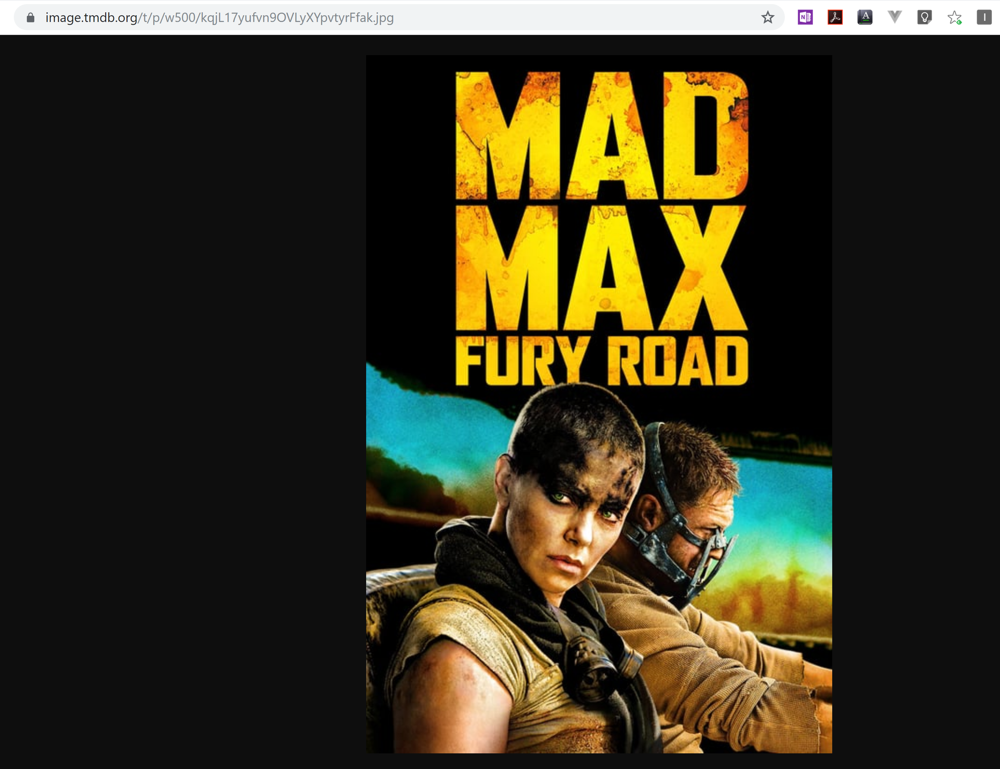

### url 로 이미지가 주어졌을 때 안드로이드에서 ImageView 로 띄우는 방법

- 우선 build.gradle 파일에 Glide 디펜던시를 아래와 같이 추가해 줍니다.

- 1)  build.gradle (Project : ... ) 인 파일에 들어가서 repositories 괄호 안에다가 mavenCentral()과 google() 을 추가해 주세요

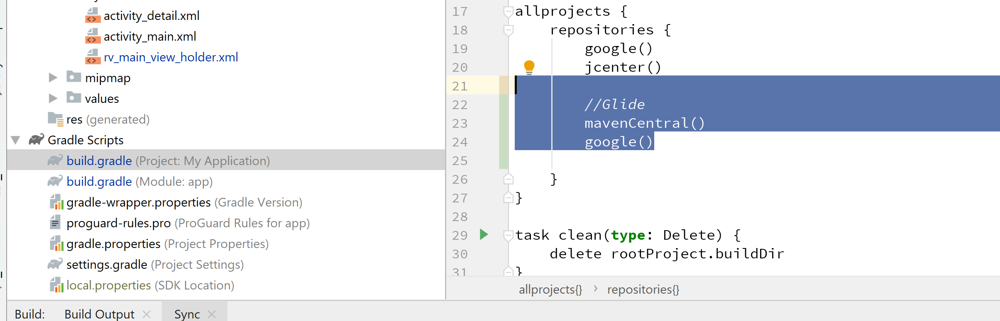

- 2) build.grade(Module : app) 에다가 아래의 디펜던시를 추가해 주세요

    //Glide
      implementation 'com.github.bumptech.glide:glide:4.10.0'
      annotationProcessor 'com.github.bumptech.glide:compiler:4.10.0'

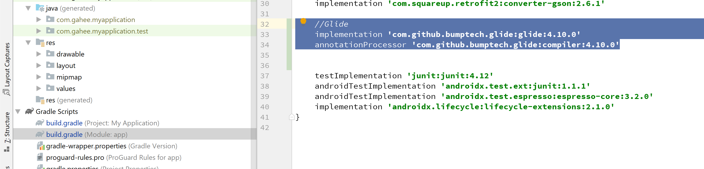

- **POSTER_BASE_URL 은 Constants 클래스 안에 정의되어야 합니다.**

    public class Constants {
    
        //TODO 2 : 쿼리에 필요한 상수들을 정의합니다.
    
        public static final String BASE_URL = "https://api.themoviedb.org/3/";
    
        public static final String POSTER_BASE_URL = "https://image.tmdb.org/t/p/w500";
        //https://api.themoviedb.org/3/movie/popular?api_key=2c702e667781c19eb48ec3b2193c97c8&language=en-US&page=1
    
        //queries
        public static final String KEY_LANGUAGE = "language";
        public static final String EN = "en-US";
        public static final String KEY_PAGE = "page";
        public static final String PAGE = "1";
    
    }

- Adapter 클래스에 다시 들어갑니다.
- **onBindViewHolder 메소드 안에다가 아래와 같이 Glide 를 사용해서 이미지를 띄워주세요.**

    @Override
        public void onBindViewHolder(@NonNull MyViewHolder holder, int position) {
            //여기서 뷰홀더에 position 별로 데이터 뿌려줌
            //생성자로 넘겨받은 movie 데이터를 연결해 줍시다.
    
            Movie movie = movies.get(position);
            holder.tvMovieTitle.setText(movie.getTitle());
            holder.tvMovieReleaseDate.setText(movie.getReleaseDate());
            holder.tvMovieVoteAverage.setText(movie.getVoteAverage());
            holder.tvMovieSynopsis.setText(movie.getOverview());
    
            //Glide 사용해서 이미지 띄우기
            //https://image.tmdb.org/t/p/w500/kqjL17yufvn9OVLyXYpvtyrFfak.jpg
    
            Glide.with(context)
                    .load(POSTER_BASE_URL + movie.getPosterPath())
                    .into(holder.imgMoviePoster);
        }

→ 이렇게까지 하고 나면 다음과 같은 결과가 나옵니다. 

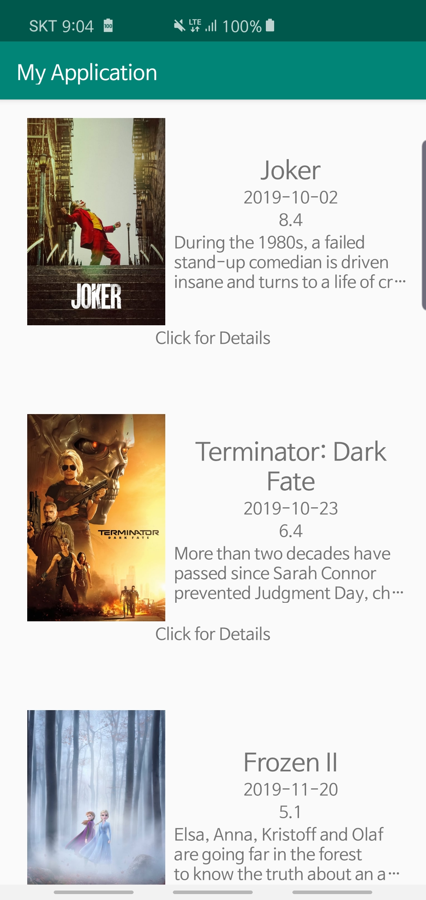

---

- **우선 여기까지 하고 다음 편에 이어서 작성하도록 하겠습니다.**